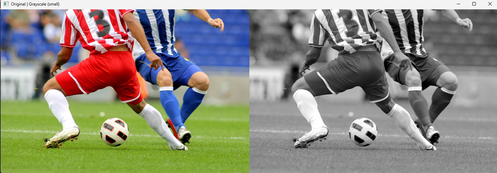

# 01. 이미지 불러오기 및 그레이스케일 변환

## 문제

OpenCV를 사용해 이미지를 불러오고,
원본 이미지와 그레이스케일로 변환된 이미지를 **가로로 나란히 출력**한다.

### 요구사항

* `cv.imread()`로 이미지 로드
* `cv.cvtColor()`로 그레이스케일 변환 (`cv.COLOR_BGR2GRAY`)
* `np.hstack()`으로 원본과 그레이스케일 이미지를 가로로 연결
* `cv.imshow()`와 `cv.waitKey()`로 화면 표시 후 **아무 키나 누르면 종료**
* (추가) 출력 이미지가 너무 크면 `cv.resize()`로 축소하여 출력

---

## 문제에 대한 개념

### 1) OpenCV 이미지 로드(BGR)

OpenCV는 이미지를 기본적으로 **BGR 순서**로 읽는다.

```python
img = cv.imread(img_path)
```

### 2) 그레이스케일 변환

컬러(BGR) 이미지를 단일 채널(Gray)로 변환한다.

```python
gray = cv.cvtColor(img, cv.COLOR_BGR2GRAY)
```

### 3) `np.hstack()`을 위한 채널 맞추기(중요)

`np.hstack()`은 두 이미지의 **높이/채널 수가 같아야** 한다.
원본 이미지는 (H, W, 3)인데, 그레이 이미지는 (H, W)라서 그대로 붙이면 오류/불일치가 발생한다.
따라서 그레이 이미지를 다시 3채널(BGR)로 변환한다.

```python
gray_bgr = cv.cvtColor(gray, cv.COLOR_GRAY2BGR)
combined = np.hstack((img, gray_bgr))
```

### 4) 출력이 너무 큰 경우 축소 출력

가로로 붙이면 더 커지므로, `fx`, `fy` 비율로 축소해서 보기 편하게 만든다.

```python
combined_small = cv.resize(combined, dsize=(0, 0), fx=0.5, fy=0.5)
```

---

## 전체 코드

```python
import cv2 as cv                    # OpenCV 사용
import numpy as np               # NumPy 사용(배열 결합용)
import sys                            # 종료/에러 처리용(sys.exit)
import os                             # 파일 존재 여부 확인용

def main():                           # 메인 로직을 담는 함수 정의
    img_path = "soccer.jpg"      # 읽어올 이미지 파일 경로(현재 작업 디렉토리 기준)

    if not os.path.exists(img_path):   # img_path 위치에 파일이 실제로 존재하는지 확인
        print("파일이 존재하지 않습니다.") # 파일이 없으면 사용자에게 메시지 출력
        sys.exit(1)                    # 비정상 종료 코드(1)로 프로그램 종료

    # 1) 이미지 로드
    img = cv.imread(img_path)    # 이미지 파일을 읽어 BGR 형식의 NumPy 배열로 로드(OpenCV 기본은 BGR)

    if img is None:              # 파일을 못 읽었거나(손상/권한/경로 문제 등) 로드 실패 시 None 반환
        print("파일을 읽을 수 없습니다.") # 실패 메시지 출력
        sys.exit(1)              # 비정상 종료 코드(1)로 프로그램 종료

    # 2) 그레이스케일 변환 (BGR -> GRAY)
    gray = cv.cvtColor(img, cv.COLOR_BGR2GRAY)  # 컬러(BGR) 이미지를 1채널 그레이스케일로 변환

    # 3) np.hstack을 위해 GRAY(1채널) -> BGR(3채널)로 맞추기
    gray_bgr = cv.cvtColor(gray, cv.COLOR_GRAY2BGR)  # 그레이(1채널)를 BGR(3채널)로 변환해 채널 수 맞춤

    # 4) 가로로 연결
    combined = np.hstack((img, gray_bgr))  # 원본(img)과 변환 이미지(gray_bgr)를 가로 방향으로 붙여 하나로 만듦

    # 5)캡처처럼 fx, fy로 축소 (예: 0.5 = 반으로)
    combined_small = cv.resize(            # 결과 이미지를 화면 표시용으로 축소/확대
        combined,                           # 리사이즈할 대상 이미지
        dsize=(0, 0),                       # dsize를 (0,0)으로 두면 fx, fy 배율을 사용
        fx=0.5,                             # 가로 크기 배율(0.5면 절반)
        fy=0.5                              # 세로 크기 배율(0.5면 절반)
    )

    # 6) 출력 + 아무 키나 누르면 닫기
    cv.imshow("Original | Grayscale (small)", combined_small)  # 창 제목과 함께 이미지 표시
    cv.waitKey(0)                                              # 키 입력을 무한 대기(아무 키나 누르면 다음 줄로)
    cv.destroyAllWindows()                                      # 열려있는 모든 OpenCV 창 닫기

if __name__ == "__main__":      # 이 파일이 '직접 실행'될 때만 아래 코드를 실행(모듈로 import될 땐 실행 X)
    main()                       # main 함수 호출
```

---

## 핵심 코드

### 1) 그레이스케일 변환

```python
gray = cv.cvtColor(img, cv.COLOR_BGR2GRAY)
```

### 2) hstack을 위한 채널 맞추기 + 연결

```python
gray_bgr = cv.cvtColor(gray, cv.COLOR_GRAY2BGR)
combined = np.hstack((img, gray_bgr))
```

### 3) 출력 크기 축소

```python
combined_small = cv.resize(combined, dsize=(0, 0), fx=0.5, fy=0.5)
```

---

## 실행 방법

프로젝트 폴더에 `soccer.jpg`와 `.py` 파일이 같이 있어야 한다.

```bash
python 01_load_and_grayscale.py
```

---

## 실행 결과

* `Original | Grayscale (small)` 창이 뜨고,

  * 왼쪽: 원본 컬러 이미지
  * 오른쪽: 그레이스케일 이미지
    가 **가로로 나란히** 표시된다.
* 아무 키나 누르면 창이 닫히며 프로그램이 종료된다.



아래는 **02번 과제용 README.md (마크다운)** 이고, 너가 올린 코드 기준으로 구성(문제 / 개념 / 전체 코드+핵심 / 실행결과) 맞춰서 작성했어. 그대로 `README.md`에 붙여넣으면 돼.

---

# 02. 페인팅 붓 크기 조절 기능 추가

## 문제

마우스로 이미지 위에 그림을 그리는 “페인팅” 기능을 만들고,
키보드 입력으로 **붓(브러시) 크기를 조절**하는 기능을 추가한다.

### 요구사항

* 초기 붓 크기: **5**
* `+` 입력 시 붓 크기 **1 증가**, `-` 입력 시 **1 감소**
* 붓 크기 범위: **최소 1 ~ 최대 15**
* **좌클릭 = 파란색**, **우클릭 = 빨간색**, **드래그로 연속 그리기**
* `q` 키를 누르면 종료

---

## 문제에 대한 개념

### 1) 마우스 이벤트 처리: `cv.setMouseCallback()`

OpenCV는 마우스 입력을 콜백 함수로 처리한다.
`cv.setMouseCallback(window_name, callback, param)` 형태로 등록하면,
해당 창에서 발생하는 마우스 이벤트가 콜백 함수로 전달된다.

```python
cv.setMouseCallback("Paint", on_mouse, img)
```

### 2) 브러시(붓) 그리기: `cv.circle()`

현재 브러시 크기(`brush`)를 반지름으로 하여 원을 그리면 붓으로 그리는 효과가 난다.
`thickness=-1`이면 원이 **채워져서** 붓처럼 찍힌다.

```python
cv.circle(img, (x, y), brush, color, -1)
```

### 3) 드래그로 연속 그리기

* 버튼을 누르면 `drawing=True`
* 마우스가 움직이는 동안(`EVENT_MOUSEMOVE`) `drawing=True`이면 계속 원을 그려 연속 선처럼 보이게 한다.
* 버튼을 떼면 `drawing=False`

### 4) 키 입력 처리: `cv.waitKey(1)`

`cv.waitKey(1)`은 키 입력을 1ms 동안 기다리며 이벤트를 처리한다.
반복 루프 안에서 이를 호출해 `+`, `-`, `q`를 구분한다.

```python
k = cv.waitKey(1) & 0xFF
```

---

## 전체 코드

```python
import cv2 as cv                      # OpenCV 기능 사용(창/마우스/그리기/키입력)
import numpy as np                    # NumPy 사용(이번 코드에서는 직접 연산은 없지만 관례적으로 포함)
import sys                            # 오류 발생 시 프로그램 종료(sys.exit)용
import os                             # 파일 존재 여부 확인(os.path.exists)용

# (0) 전역 설정: 붓 크기 / 드래그 상태 / 현재 색상
brush = 5                             # 초기 붓 크기(요구사항: 5)
drawing = False                       # 마우스를 누른 채로 드래그 중인지 상태 저장
color = (255, 0, 0)                   # 현재 그릴 색상(BGR 기준: 파랑)

def on_mouse(event, x, y, flags, img):  # 마우스 이벤트가 발생할 때 호출되는 콜백 함수
    global drawing, color, brush      # 콜백 내부에서 전역 상태(드래그/색/붓)를 수정하기 위해 선언

    # (4) 마우스 이벤트 처리 (힌트: setMouseCallback + circle)
    if event == cv.EVENT_LBUTTONDOWN: # 왼쪽 버튼을 누르는 순간(그리기 시작)
        drawing = True                # 드래그 시작 상태로 전환
        color = (255, 0, 0)           # 좌클릭은 파랑(BGR)
        cv.circle(img, (x, y), brush, color, -1)  # 현재 위치에 원을 채워서 점을 찍음(-1은 채움)

    elif event == cv.EVENT_RBUTTONDOWN: # 오른쪽 버튼을 누르는 순간(그리기 시작)
        drawing = True                # 드래그 시작 상태로 전환
        color = (0, 0, 255)           # 우클릭은 빨강(BGR)
        cv.circle(img, (x, y), brush, color, -1)  # 현재 위치에 원을 채워서 점을 찍음

    elif event == cv.EVENT_MOUSEMOVE and drawing: # 마우스 이동 중이며 버튼이 눌린 상태면
        cv.circle(img, (x, y), brush, color, -1)  # 이동 경로에 계속 원을 찍어서 선처럼 보이게 그림

    elif event in (cv.EVENT_LBUTTONUP, cv.EVENT_RBUTTONUP): # 버튼을 떼는 순간(그리기 종료)
        drawing = False               # 드래그 종료 상태로 전환

def main():                           # 프로그램 실행 흐름을 담당하는 메인 함수
    global brush                      # 키 입력으로 붓 크기를 변경하기 위해 전역 brush 사용

    # (1) 이미지 로드
    img_path = "soccer.jpg"           # 배경으로 사용할 이미지 파일 경로
    if not os.path.exists(img_path):  # 파일이 존재하는지 먼저 확인
        print("파일이 존재하지 않습니다.") # 파일이 없으면 안내 메시지 출력
        sys.exit(1)                   # 에러 코드로 종료

    img = cv.imread(img_path)         # 이미지 로드(OpenCV 기본 BGR)
    if img is None:                   # 로드 실패 여부 확인
        print("파일을 읽을 수 없습니다.") # 로드 실패 메시지 출력
        sys.exit(1)                   # 에러 코드로 종료

    # (2) 창 생성
    cv.namedWindow("Paint")           # "Paint"라는 이름의 창 생성

    # (3) 마우스 콜백 등록 (힌트: cv.setMouseCallback)
    cv.setMouseCallback("Paint", on_mouse, img)  # "Paint" 창에 콜백 등록 + img를 콜백으로 전달

    # (5) 키 입력 처리 루프 (힌트: cv.waitKey(1)로 +, -, q 구분)
    while True:                       # 키 입력을 계속 받기 위한 반복 루프
        cv.imshow("Paint", img)       # 현재 img(그림이 그려진 상태)를 창에 표시
        k = cv.waitKey(1) & 0xFF      # 1ms 대기하며 키 입력을 받고 하위 8비트만 사용

        # (6) q 키 누르면 종료
        if k == ord('q'):             # q 입력 시 종료 조건
            break                     # 반복 루프 탈출

        # (7) + 입력 시 붓 크기 1 증가 (최대 15)
        elif k in (ord('+'), ord('=')): # '+' 입력(키보드에 따라 '='로 들어오는 경우 포함)
            brush = min(15, brush + 1) # 붓 크기를 1 증가시키되 최대 15로 제한
            print("brush:", brush)    # 현재 붓 크기 출력(확인용)

        # (8) - 입력 시 붓 크기 1 감소 (최소 1)
        elif k in (ord('-'), ord('_')): # '-' 입력(키보드에 따라 '_'로 들어오는 경우 포함)
            brush = max(1, brush - 1) # 붓 크기를 1 감소시키되 최소 1로 제한
            print("brush:", brush)    # 현재 붓 크기 출력(확인용)

    # (9) 종료 처리
    cv.destroyAllWindows()            # 모든 OpenCV 창 닫기(종료 처리)

if __name__ == "__main__":            # 이 파일을 직접 실행할 때만 main() 수행
    main()                            # 메인 함수 호출
```

---

## 핵심 코드

### 1) 마우스 콜백 등록

```python
cv.setMouseCallback("Paint", on_mouse, img)
```

### 2) 원으로 붓 그리기 (`cv.circle`)

```python
cv.circle(img, (x, y), brush, color, -1)
```

### 3) 키 입력으로 붓 크기 변경 (1~15 제한)

```python
elif k in (ord('+'), ord('=')):
    brush = min(15, brush + 1)

elif k in (ord('-'), ord('_')):
    brush = max(1, brush - 1)
```

---

## 실행 방법

`02_*.py` 파일과 `soccer.jpg`가 같은 폴더에 있어야 한다.

```bash
python 02_paint_on_image_brush.py
```

---

## 실행 결과

* `Paint` 창에 `soccer.jpg`가 출력된다.
* **좌클릭 드래그**: 파란색으로 연속 그리기
* **우클릭 드래그**: 빨간색으로 연속 그리기
* `+` 키: 붓 크기 증가 (최대 15)
* `-` 키: 붓 크기 감소 (최소 1)
* `q` 키: 프로그램 종료
* 붓 크기 변경 시 터미널에 `brush: 숫자` 형태로 출력된다.

# 03. 마우스로 영역 선택 및 ROI(관심영역) 추출

## 문제

이미지를 불러온 뒤, 사용자가 마우스로 **클릭 + 드래그**하여 사각형 영역(ROI)을 선택한다.
마우스를 놓으면 해당 영역을 잘라서 **별도의 창에 표시**하고, 키보드 입력으로 **리셋/저장** 기능을 제공한다.

### 요구사항

* 이미지를 로드하여 화면에 출력
* `cv.setMouseCallback()`으로 마우스 이벤트 처리
* 클릭한 시작점에서 드래그하여 **사각형으로 ROI 선택**
* 마우스를 놓으면 ROI를 잘라서 **별도 창에 출력**
* `r` 키: 선택 초기화 후 다시 선택
* `s` 키: 선택한 ROI를 이미지 파일로 저장
* (힌트) 드래그 중 사각형 시각화: `cv.rectangle()`
* (힌트) ROI 추출: numpy 슬라이싱
* (힌트) ROI 저장: `cv.imwrite()`

---

## 문제에 대한 개념

### 1) 마우스 이벤트 처리 (`cv.setMouseCallback`)

OpenCV는 마우스 입력을 콜백 함수로 처리한다.
`cv.setMouseCallback("Image", on_mouse, param)` 형태로 등록하면 해당 창에서 발생하는 마우스 이벤트가 콜백 함수로 전달된다.

```python id="sz3p6n"
cv.setMouseCallback("Image", on_mouse, (img, show))
```

### 2) 드래그로 ROI 범위 결정

* `EVENT_LBUTTONDOWN`: 시작점 `start_pt` 저장, 드래그 시작
* `EVENT_MOUSEMOVE`: 드래그 중이면 현재 좌표 `end_pt` 갱신
* `EVENT_LBUTTONUP`: 드래그 종료, 최종 좌표 확정

좌표는 드래그 방향이 반대로 될 수 있으므로 `sorted()`로 `(x_min, x_max)`, `(y_min, y_max)`를 만든다.

### 3) 드래그 중 시각화 (`cv.rectangle`)

선택 중인 영역을 사용자에게 보여주기 위해, 원본 이미지 복사본(`show`)에 사각형을 그려서 출력한다.

```python id="f1v2u5"
cv.rectangle(show, start_pt, end_pt, (0, 255, 0), 2)
```

### 4) ROI 추출: numpy 슬라이싱

이미지 배열은 `img[y1:y2, x1:x2]` 형태로 잘라낼 수 있다.

```python id="hyi3ox"
roi = img[y_min:y_max, x_min:x_max].copy()
```

### 5) ROI 저장 (`cv.imwrite`)

선택된 ROI가 있을 때 `cv.imwrite()`로 파일로 저장한다.

```python id="k7p5w5"
cv.imwrite("roi.png", roi)
```

---

## 전체 코드

```python 
import cv2 as cv                          # OpenCV 사용(창/마우스 이벤트/도형 그리기/저장)
import numpy as np                        # NumPy 사용(ROI 슬라이싱은 배열 연산 기반)
import os                                 # 파일 존재 여부 확인(os.path.exists)용
import sys                                # 오류 시 종료(sys.exit)용

# (0) 전역 상태: 드래그 시작점/현재점/드래그 중 여부/ROI
start_pt = None                           # 드래그 시작 좌표(처음 클릭한 위치)
end_pt = None                             # 드래그 현재/종료 좌표(마우스가 가리키는 위치)
dragging = False                          # 드래그 진행 중인지 여부
roi = None                                # 선택된 ROI 이미지(잘라낸 결과)

def on_mouse(event, x, y, flags, param):  # 마우스 이벤트 콜백(이벤트, 좌표, 플래그, 사용자 파라미터)
    global start_pt, end_pt, dragging, roi # 콜백에서 전역 상태를 갱신하기 위해 global 선언
    img, show = param                     # img: 원본 이미지, show: 표시용(여기서는 콜백에서 직접 수정 X)

    # (3) 마우스 드래그 시작점 기록
    if event == cv.EVENT_LBUTTONDOWN:     # 왼쪽 버튼을 누르는 순간(드래그 시작)
        dragging = True                   # 드래그 상태를 시작으로 설정
        start_pt = (x, y)                 # 시작 좌표를 현재 마우스 좌표로 저장
        end_pt = (x, y)                   # 초기 종료 좌표도 시작점으로 맞춰둠(사각형 초기화)

    # (4) 드래그 중이면 사각형을 계속 업데이트해서 시각화 (힌트: cv.rectangle)
    elif event == cv.EVENT_MOUSEMOVE and dragging: # 드래그 중 마우스가 움직일 때
        end_pt = (x, y)                   # 현재 좌표를 종료 좌표로 계속 갱신(루프에서 사각형 그림)

    # (5) 마우스 놓으면 ROI 확정 + 별도 창에 출력 (힌트: numpy 슬라이싱)
    elif event == cv.EVENT_LBUTTONUP and dragging: # 왼쪽 버튼을 떼는 순간(드래그 종료)
        dragging = False                  # 드래그 상태 종료
        end_pt = (x, y)                   # 마지막 좌표를 종료점으로 확정

        x1, y1 = start_pt                 # 시작점 좌표를 분해(x1, y1)
        x2, y2 = end_pt                   # 종료점 좌표를 분해(x2, y2)
        x_min, x_max = sorted([x1, x2])   # 드래그 방향과 무관하게 좌/우 경계를 정렬
        y_min, y_max = sorted([y1, y2])   # 드래그 방향과 무관하게 상/하 경계를 정렬

        # 빈 선택 방지
        if x_max - x_min > 0 and y_max - y_min > 0:     # 너비/높이가 0이면 ROI가 비므로 제외
            roi = img[y_min:y_max, x_min:x_max].copy()  # 원본에서 ROI를 슬라이싱하고 별도 메모리로 복사
            cv.imshow("ROI", roi)                       # 선택된 ROI를 별도 창으로 즉시 표시

def main():                             # 프로그램 실행 흐름을 담당하는 메인 함수
    global start_pt, end_pt, dragging, roi # 키 입력(r/s)에서 전역 상태를 변경하므로 global 선언

    # (1) 이미지 로드
    img_path = "soccer.jpg"             # 입력 이미지 파일 경로
    if not os.path.exists(img_path):    # 파일 존재 여부 확인
        print("파일이 존재하지 않습니다.") # 파일이 없으면 안내 메시지 출력
        sys.exit(1)                     # 에러 코드로 종료

    img = cv.imread(img_path)           # 이미지 로드(OpenCV 기본 BGR)
    if img is None:                     # 로드 실패 여부 확인
        print("파일을 읽을 수 없습니다.") # 로드 실패 메시지 출력
        sys.exit(1)                     # 에러 코드로 종료

    # (2) 표시용 이미지(사각형 그리기) 준비 + 콜백 등록
    show = img.copy()                   # 화면 표시용 이미지(원본 위에 사각형을 그릴 때 사용)
    cv.namedWindow("Image")             # "Image" 이름의 창 생성
    cv.setMouseCallback("Image", on_mouse, (img, show)) # 마우스 콜백 등록 + 원본/표시용을 파라미터로 전달

    # (6) 키 입력 루프: r=리셋, s=저장
    while True:                         # 매 프레임 화면 갱신 + 키 입력을 받는 루프
        show = img.copy()               # 매 루프마다 원본으로부터 표시용을 새로 만들어 잔상 누적 방지

        if dragging and start_pt and end_pt:            # 드래그 중이고 좌표가 준비되어 있으면
            cv.rectangle(show, start_pt, end_pt, (0, 255, 0), 2) # 표시용 이미지에 현재 사각형을 그림(BGR, 두께 2)

        cv.imshow("Image", show)        # 현재 표시용 이미지를 창에 출력
        k = cv.waitKey(1) & 0xFF        # 1ms 대기하며 키 입력을 받고 하위 8비트만 사용

        if k in (27, ord('q')):         # ESC(27) 또는 q 입력 시 종료
            break                       # 루프 탈출

        elif k == ord('r'):             # r 입력 시 선택 상태 리셋
            start_pt = end_pt = None    # 시작/끝 좌표 초기화
            dragging = False            # 드래그 상태 강제 종료
            roi = None                  # ROI 결과 초기화
            cv.destroyWindow("ROI")     # ROI 창이 열려 있으면 닫기(없으면 무시될 수 있음)

        elif k == ord('s'):             # s 입력 시 ROI를 파일로 저장
            if roi is not None:         # ROI가 실제로 선택된 상태인지 확인
                cv.imwrite("roi.png", roi) # ROI 이미지를 roi.png로 저장
                print("Saved: roi.png") # 저장 완료 메시지 출력
            else:                       # ROI가 아직 없으면
                print("ROI가 없습니다. 마우스로 영역을 먼저 선택하세요.") # 먼저 선택하라고 안내

    # (7) 종료 처리
    cv.destroyAllWindows()              # 열린 모든 OpenCV 창 닫기

if __name__ == "__main__":              # 이 파일을 직접 실행할 때만 main() 수행
    main()                               # 메인 함수 호출
```

---

## 핵심 코드

### 1) 드래그 중 사각형 표시 (`cv.rectangle`)

```python id="ibpy1z"
if dragging and start_pt and end_pt:
    cv.rectangle(show, start_pt, end_pt, (0, 255, 0), 2)
```

### 2) ROI 추출 (numpy 슬라이싱)

```python id="xmj8e3"
x_min, x_max = sorted([x1, x2])
y_min, y_max = sorted([y1, y2])
roi = img[y_min:y_max, x_min:x_max].copy()
```

### 3) ROI 저장 (`cv.imwrite`)

```python id="2b4tq8"
if roi is not None:
    cv.imwrite("roi.png", roi)
```

---

## 실행 방법

`03_*.py` 파일과 `soccer.jpg`가 같은 폴더에 있어야 한다.

```bash id="f3h0tt"
python 03_roi_select_save.py
```

---

## 실행 결과

* `Image` 창에 원본 이미지가 출력된다.
* 마우스로 **좌클릭 후 드래그**하면 녹색 사각형이 표시되며 ROI가 선택된다.
* 마우스를 놓는 순간 선택한 영역이 잘려서 `ROI` 창에 표시된다.
* `r` 키를 누르면 선택이 초기화되고, 다시 ROI를 선택할 수 있다.
* `s` 키를 누르면 현재 선택된 ROI가 `roi.png`로 저장되며, 터미널에 `Saved: roi.png`가 출력된다.
* `q` 또는 `ESC`로 프로그램을 종료한다.

