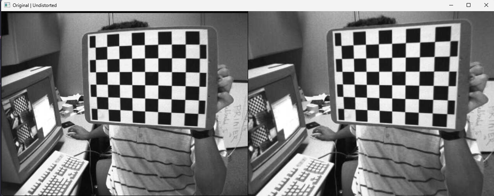
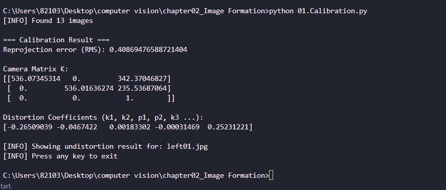
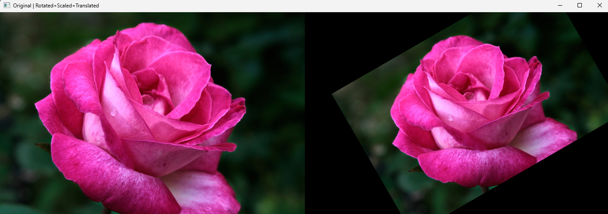
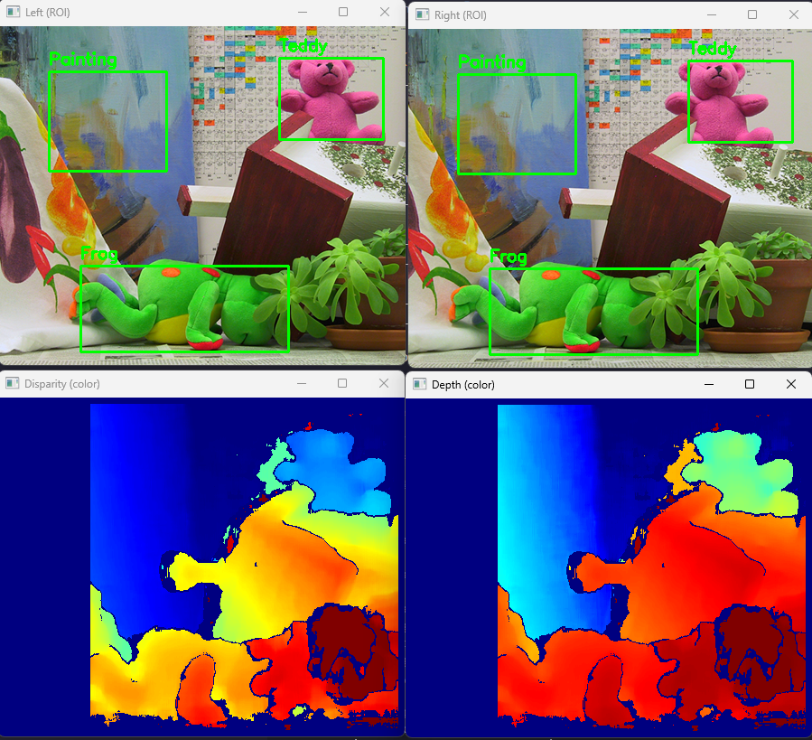
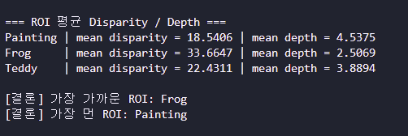

# 01. 체커보드 기반 카메라 캘리브레이션

##  문제

체커보드(체스판) 이미지 여러 장에서 **코너(교차점)를 검출**하고,
검출된 2D 이미지 좌표와 체커보드의 3D 실제 좌표의 대응 관계를 이용해 카메라의

* **내부 파라미터(카메라 행렬 K)**
* **렌즈 왜곡 계수(distortion coefficients)**

를 추정한다. 추정된 파라미터로 `cv2.undistort()`를 적용해 **왜곡 보정 결과를 시각화**한다.

### 요구사항(슬라이드 기준)

* 모든 이미지에서 체커보드 코너 검출 (`cv2.findChessboardCorners`)
* 실제 좌표(objpoints)와 이미지 좌표(imgpoints) 구성
* `cv2.calibrateCamera()`로 K와 dist 계산
* `cv2.undistort()`로 왜곡 보정 결과 확인

---

##  개념

### 1) 체커보드 코너 검출 (`cv2.findChessboardCorners`)

체커보드의 **내부 코너 개수(가로, 세로)** 를 알고 있을 때,
이미지에서 해당 코너들의 2D 좌표를 찾는다.

* 입력: 그레이 이미지, 내부 코너 개수 `(cols, rows)`
* 출력: 성공 여부(ret), 코너 좌표(corners)

추가로 `cv2.cornerSubPix()`를 사용하면 코너 좌표를 서브픽셀 단위로 정밀화할 수 있어 캘리브레이션 정확도가 올라간다.

---

### 2) 카메라 캘리브레이션 (`cv2.calibrateCamera`)

여러 장의 이미지에서 얻은

* 3D 실제 좌표 `objpoints`
* 2D 이미지 좌표 `imgpoints`

를 이용해 카메라 파라미터를 추정한다.

* **Camera matrix K (3×3)**
  [
  K=
  \begin{bmatrix}
  f_x & 0 & c_x \
  0 & f_y & c_y \
  0 & 0 & 1
  \end{bmatrix}
  ]

  * (f_x, f_y): 초점거리(픽셀 단위)
  * (c_x, c_y): 주점(principal point)

* **Distortion coefficients dist**
  일반적으로 `[k1, k2, p1, p2, k3]`

  * (k1,k2,k3): 방사 왜곡(Radial)
  * (p1,p2): 접선 왜곡(Tangential)

* **RMS Reprojection Error**: 작을수록 캘리브레이션이 잘 된 것

---

### 3) 왜곡 보정 (`cv2.undistort`)

추정된 `K, dist`를 이용해 이미지의 렌즈 왜곡을 보정한다.
보정 전/후 이미지를 나란히 출력하면 직선이 더 “곧게” 보이는지 확인할 수 있다.

---

##  전체 코드

```python
import cv2  # OpenCV 함수(코너 검출/캘리브레이션/왜곡보정)를 쓰기 위해 임포트 → 이후 calibrate/undistort 가능
import numpy as np  # 수치연산/좌표배열 생성에 사용 → objp, 슬라이싱, hstack 등에 사용
from pathlib import Path  # 경로를 OS에 안전하게 다루기 위해 사용 → 한글 경로 포함 파일 탐색 가능

# (A) 한글/특수문자 경로에서도 안전한 imread: cv2.imread가 한글 경로에서 실패할 수 있어 우회 로더를 사용
def imread_unicode(path, flags=cv2.IMREAD_COLOR):  # 한글 경로에서도 이미지를 읽기 위한 함수 정의 
    data = np.fromfile(str(path), dtype=np.uint8)  # 파일을 바이트로 읽음 → 경로 인코딩 문제를 피함
    img = cv2.imdecode(data, flags)  # 바이트를 이미지로 디코딩 → 실제 이미지 배열(BGR 등) 반환
    return img  # 디코딩된 이미지 반환 → 이후 처리(cv2.cvtColor 등)에 사용

# (0) 설정값: 체커보드 크기/스케일/정밀화 조건을 지정해서 코너 검출과 보정을 안정화
CHECKERBOARD = (9, 6)      # 내부 코너 개수 (가로, 세로) → findChessboardCorners가 이 개수로 코너를 찾음
square_size = 25.0         # 한 칸 크기(mm) → 실제(3D) 좌표 스케일을 mm로 맞춤
criteria = (cv2.TERM_CRITERIA_EPS + cv2.TERM_CRITERIA_MAX_ITER, 30, 0.001)  # 서브픽셀 반복 조건 → 코너 좌표가 더 정확해짐

# (1) 실제(3D) 좌표 준비  # 체크보드의 실제 격자 좌표를 만들고, 이미지 코너(2D)와 매칭하기 위함
objp = np.zeros((CHECKERBOARD[0] * CHECKERBOARD[1], 3), np.float32)  # (N,3) 3D 점 배열 생성 → (x,y,z) 형태
objp[:, :2] = np.mgrid[0:CHECKERBOARD[0], 0:CHECKERBOARD[1]].T.reshape(-1, 2)  # (x,y) 격자 좌표 채움 → z=0 평면 가정
objp *= square_size  # 실제 단위(mm)로 스케일 적용 → depth/왜곡 계수 추정에 실제 크기 반영

objpoints = []  # 각 이미지의 3D 실제 좌표 목록 → calibrateCamera 입력으로 사용
imgpoints = []  # 각 이미지의 2D 코너 좌표 목록 → calibrateCamera 입력으로 사용

# (2) 이미지 목록 수집: 캘리브레이션에 사용할 여러 장의 체크보드 이미지를 모으기 위함
img_dir = Path("L02 실습/images/calibration_images")  # 체크보드 이미지 폴더 경로 지정 
images = sorted(img_dir.glob("left*.jpg"))  # left01~left13 같은 파일 목록 수집 → 캘리브레이션 입력 이미지들

if not images:  # 이미지가 하나도 없으면 진행 불가 → 파일 경로 문제를 바로 알림
    raise FileNotFoundError(f"이미지 없음: {img_dir} / left*.jpg 경로 확인")  # 실행 즉시 중단 → 경로 수정 필요

print(f"[INFO] Found {len(images)} images")  # 몇 장을 찾았는지 출력 → 정상적으로 파일을 찾았는지 확인

img_size = None  # 이미지 크기(W,H)를 저장할 변수 → calibrateCamera에 필요

# (3) 코너 검출 + 대응점 수집  # 각 이미지에서 코너를 찾아 (3D-2D) 대응점을 쌓기 위함
for fname in images:  # 이미지 목록을 하나씩 처리 → 성공한 것만 objpoints/imgpoints에 추가
    img = imread_unicode(fname)  # 한글 경로 안전 로더로 이미지 읽기 → img가 None이면 디코딩 실패
    if img is None:  # 읽기에 실패하면 다음 이미지로 넘어감 → 캘리브레이션 데이터 부족 방지
        print(f"[skip] cannot read: {fname}")  # 어떤 파일이 실패했는지 출력 → 경로/파일 손상 확인
        continue  # 실패 파일은 제외 → 다음 이미지 처리

    gray = cv2.cvtColor(img, cv2.COLOR_BGR2GRAY)  # 코너 검출은 보통 그레이에서 수행 → 코너 탐지가 안정적
    img_size = gray.shape[::-1]  # (W, H) 형태로 저장 → calibrateCamera의 imageSize로 사용

    flags = cv2.CALIB_CB_ADAPTIVE_THRESH + cv2.CALIB_CB_NORMALIZE_IMAGE  # 코너 검출 보조 옵션 → 다양한 조명에서 성공률 증가
    ret, corners = cv2.findChessboardCorners(gray, CHECKERBOARD, flags)  # 체크보드 코너 검출 → 성공하면 corners에 좌표 저장

    if not ret:  # 코너를 못 찾았으면 해당 이미지는 제외 → 잘못된 대응점 방지
        print(f"[skip] corners not found: {fname}")  # 실패한 파일 출력 → CHECKERBOARD 설정/이미지 품질 점검
        continue  # 실패 이미지는 건너뜀 → 다음 이미지 처리

    corners2 = cv2.cornerSubPix(gray, corners, (11, 11), (-1, -1), criteria)  # 코너를 서브픽셀로 정밀화 → 캘리브레이션 정확도 향상

    objpoints.append(objp)  # 이 이미지에 대응하는 3D 점 추가 → N개 코너의 실제 좌표
    imgpoints.append(corners2)  # 이 이미지에서 찾은 2D 점 추가 → N개 코너의 이미지 좌표

    # 코너 시각화: 코너가 잘 잡혔는지 눈으로 확인하기 위한 디버깅용 표시
    vis = img.copy()  # 원본을 복사해서 그리기용 이미지 생성 → 원본 손상 방지
    cv2.drawChessboardCorners(vis, CHECKERBOARD, corners2, ret)  # 코너 표시(점/선) → 검출 성공 여부를 시각 확인
    cv2.imshow("Corners", vis)  # 코너가 그려진 이미지를 창에 띄움 → 진행 중 상태 확인
    cv2.waitKey(80)  # 80ms 보여줌 → 여러 장이 빠르게 넘어가며 확인 가능

cv2.destroyAllWindows()  # 코너 확인 창 닫기 → 다음 결과(undistort) 출력 전에 창 정리

# (4) 캘리브레이션 (K, dist): 카메라 내부행렬 K와 왜곡계수 dist를 추정해서 왜곡보정/깊이추정에 사용
ret, K, dist, rvecs, tvecs = cv2.calibrateCamera(objpoints, imgpoints, img_size, None, None)  # K/dist 계산 → 보정 파라미터 출력 가능

print("\n=== Calibration Result ===")  # 결과 구분 출력 → 콘솔에서 보기 쉽게
print("Reprojection error (RMS):", ret)  # RMS 재투영 오차 출력 → 값이 작을수록 캘리브레이션이 잘 됨
print("\nCamera Matrix K:")  # 내부행렬 헤더 출력 → fx, fy, cx, cy 포함
print(K)  # K 행렬 출력 → 이후 undistort/3D 계산에 사용 가능
print("\nDistortion Coefficients (k1, k2, p1, p2, k3 ...):")  # 왜곡계수 헤더 출력 → 방사/접선 왜곡 파라미터
print(dist.ravel())  # dist를 1차원으로 출력 → k1,k2,p1,p2,k3 형태 확인

# (5) 왜곡 보정 시각화 (undistort)  # 추정된 K/dist로 원본을 보정해 직선이 더 곧게 보이게 만들기 위함
sample_path = images[0]  # 첫 번째 이미지를 샘플로 선택 → undistort 결과를 대표로 확인
sample = imread_unicode(sample_path)   # cv2.imread 대신! → 한글 경로에서도 샘플을 정상 로드

undist = cv2.undistort(sample, K, dist)  # 왜곡 보정 수행 → 보정된 이미지(undist) 생성

combined = np.hstack((sample, undist))  # 원본과 보정을 좌우로 붙임 → 비교가 한눈에 가능

# 화면에 너무 크게 뜨는 걸 방지하기 위해 리사이즈로 보기 편하게 만듦
max_w = 1400  # 최대 가로 폭 제한 → 모니터에 맞게 표시
h, w = combined.shape[:2]  # 현재 결합 이미지의 높이/너비 → 축소 비율 계산에 사용
if w > max_w:  # 가로가 너무 크면 축소 실행 → 창이 화면 밖으로 나가는 걸 방지
    scale = max_w / w  # 축소 비율 계산 → 비율 유지
    combined = cv2.resize(combined, (int(w * scale), int(h * scale)))  # 비율대로 축소 → 화면에 잘 보이게 출력

cv2.imshow("Original | Undistorted", combined)  # 원본/보정 비교창 표시 → 보정 효과(직선/왜곡 감소) 확인
print(f"\n[INFO] Showing undistortion result for: {Path(sample_path).name}")  # 어떤 파일을 보여주는지 출력 → 디버깅/기록용
print("[INFO] Press any key to exit")  # 종료 안내 출력 
cv2.waitKey(0)  # 아무 키 입력까지 대기 
cv2.destroyAllWindows()  # 모든 창 닫기
```

---

##  핵심 코드

### 1) 코너 검출 + 서브픽셀 정밀화

```python
ret, corners = cv2.findChessboardCorners(gray, CHECKERBOARD, flags)
corners2 = cv2.cornerSubPix(gray, corners, (11, 11), (-1, -1), criteria)
```

### 2) 캘리브레이션으로 K, dist 추정

```python
ret, K, dist, rvecs, tvecs = cv2.calibrateCamera(objpoints, imgpoints, img_size, None, None)
```

### 3) 왜곡 보정(Undistort) 비교 출력

```python
undist = cv2.undistort(sample, K, dist)
combined = np.hstack((sample, undist))
cv2.imshow("Original | Undistorted", combined)
```

---

##  실행 방법

### 1) 폴더/파일 준비

다음 위치에 이미지가 있어야 한다.

* `L02 실습/images/calibration_images/left01.jpg`
* `L02 실습/images/calibration_images/left02.jpg`
* ...
* `left13.jpg`

### 2) 실행

```bash
python 01.Calibration.py
```

---

##  실행 결과

1. 실행하면 체크보드 코너가 검출된 이미지가 `"Corners"` 창에 빠르게 표시된다.
2. 터미널에 아래 값들이 출력된다.

   * `Reprojection error (RMS)`
   * `Camera Matrix K`
   * `Distortion Coefficients dist`
3. 마지막으로 `"Original | Undistorted"` 창에서

   * 왼쪽: 원본 이미지
   * 오른쪽: 왜곡 보정 이미지
     를 나란히 비교할 수 있다.
4. 아무 키를 누르면 프로그램이 종료된다.

---


---

##  실행 결과 분석

### 1) Reprojection Error (RMS)

* 출력: `0.408694...`
* 의미: 추정한 카메라 파라미터(K, dist)로 코너를 다시 투영했을 때, **실제 검출된 코너 위치와의 평균 오차(픽셀 단위)**
* 해석: 약 **0.41 px**로 **1px 이하**이므로, 실습/과제 수준에서 **캘리브레이션이 잘 수행된 결과**로 볼 수 있다.

---

### 2) Camera Matrix (K)

출력 예:

```
[[536.07345314   0.         342.37046827]
 [  0.         536.01636274 235.53687064]
 [  0.           0.           1.        ]]
```

* (f_x \approx 536.07), (f_y \approx 536.02)

  * 의미: 픽셀 단위의 초점거리(focal length)
  * 해석: (f_x)와 (f_y)가 거의 같아 **x/y 방향 스케일 차이가 크지 않은 정상적인 형태**이다.

* (c_x \approx 342.37), (c_y \approx 235.54)

  * 의미: 주점(principal point), 즉 카메라 중심이 이미지에 맺히는 위치
  * 해석: 이미지 중심(예: 640×480이면 약 (320,240))과 약간 차이가 있으며, 이는 **센서/렌즈 정렬 오차, 크롭, 촬영 조건** 등으로 충분히 발생 가능한 값이다.

---

### 3) Distortion Coefficients (왜곡 계수)

출력 예:

```
[-0.26509039 -0.0467422   0.00183302 -0.00031469  0.25231221]
```

계수 의미:

* (k1, k2, k3): **방사 왜곡(Radial distortion)**
* (p1, p2): **접선 왜곡(Tangential distortion)**

해석:

* (k1 = -0.265) (음수)

  * 일반적으로 **핀쿠션(pincushion) 형태**의 방사 왜곡 경향을 나타낸다.
* (p1 \approx 0.00183), (p2 \approx -0.00031)

  * 접선 왜곡은 비교적 **작은 편**으로 보이며, 카메라-센서 평행이 완벽하지 않을 때 나타날 수 있다.
* (k3 \approx 0.252)

  * 고차 방사 왜곡 항으로, 렌즈 왜곡의 곡률을 추가로 보정한다.

---

### 4) Undistort 결과

* `"Original | Undistorted"` 창에서 좌측은 원본, 우측은 보정 결과이다.
* 보정 결과에서는 이미지 가장자리에서 발생하는 왜곡(직선이 휘는 현상)이 상대적으로 줄어들어, **체커보드의 격자 선이 더 직선에 가깝게 보이는 효과**를 확인할 수 있다.
* 본 실습에서는 왜곡이 매우 크지 않기 때문에 큰 차이가 눈에 띄지 않을 수 있으나, **계수(dist)가 0이 아니고 RMS가 낮게 나온 점**에서 보정 파라미터 추정이 정상적으로 수행되었음을 확인할 수 있다.

---

# 02. 이미지 Rotation & Transformation

## 문제

한 장의 이미지에 대해 **회전(rotation)**, **크기 조절(scale)**, **평행이동(translation)** 을 적용한다.
이미지의 중심을 기준으로 **+30도 회전**하고, 동시에 **크기를 0.8배로 축소**한 뒤,
그 결과를 **x축 방향으로 +80px**, **y축 방향으로 -40px** 만큼 평행이동한다.

변환 행렬은 `cv2.getRotationMatrix2D()`로 생성하고,
최종 변환은 `cv2.warpAffine()`으로 적용하여 결과를 시각화한다.

### 요구사항(슬라이드 기준)

* 한 장의 이미지에 회전, 크기 조절, 평행이동 적용
* 이미지의 중심 기준으로 **+30도 회전**
* 회전과 동시에 **크기를 0.8배로 조절**
* 그 결과를 **x축 방향 +80px, y축 방향 -40px** 만큼 평행이동
* `cv2.getRotationMatrix2D()`로 회전 행렬 생성
* `cv2.warpAffine()`으로 최종 결과 출력

---

## 개념

### 1) 회전 + 크기 조절 (`cv2.getRotationMatrix2D`)

OpenCV에서는 이미지 중심 좌표, 회전 각도, 크기 비율을 이용해
**2×3 아핀 변환 행렬**을 만들 수 있다.

```python
M = cv2.getRotationMatrix2D(center, angle, scale)
```

* `center`: 회전 기준점
* `angle`: 회전 각도 (양수면 반시계 방향)
* `scale`: 확대/축소 비율

즉, 이 함수 하나로 **회전**과 **스케일 조절**을 동시에 반영한 행렬을 만들 수 있다.

---

### 2) 평행이동 (Translation)

아핀 변환 행렬의 마지막 열은 평행이동 성분을 나타낸다.

[
M =
\begin{bmatrix}
a & b & t_x \
c & d & t_y
\end{bmatrix}
]

따라서 회전 행렬을 만든 뒤,

```python
M[0, 2] += tx
M[1, 2] += ty
```

처럼 마지막 열 값을 조정하면
기존의 **회전 + 스케일 변환 결과에 평행이동**을 추가할 수 있다.

---

### 3) 아핀 변환 적용 (`cv2.warpAffine`)

완성된 2×3 변환 행렬 `M`을 `cv2.warpAffine()`에 넣으면
이미지에 실제로 변환이 적용된다.

```python
out = cv2.warpAffine(img, M, (w, h))
```

* 입력 이미지 `img`
* 변환 행렬 `M`
* 출력 크기 `(w, h)`

이 함수는 회전, 이동, 축소/확대 같은 **선형 변환 + 평행이동**을 한 번에 처리한다.

---

## 전체 코드

```python
import cv2  # OpenCV 변환/출력 함수 사용 → 회전/이동 결과를 창으로 확인
import numpy as np  # 배열 처리(hstack/resize) 사용 → 원본과 결과를 나란히 표시
from pathlib import Path  # 경로를 안전하게 처리 → 이미지 파일을 정확히 찾음

# (0) 한글/특수문자 경로에서도 안전하게 이미지 읽기
def imread_unicode(path, flags=cv2.IMREAD_COLOR):  # 한글 경로에서도 이미지 로드 → imread 실패 방지
    data = np.fromfile(str(path), dtype=np.uint8)  # 파일을 바이트로 읽기 → 경로 인코딩 문제 회피
    return cv2.imdecode(data, flags)  # 바이트를 이미지로 디코딩 → img(BGR)가 반환됨

def main():  # 프로그램 실행 시작점 → 변환된 결과 창을 띄움
    # (1) 이미지 경로 설정 (스크립트 위치 기준)
    base = Path(__file__).resolve().parent  # 현재 .py 폴더 기준 잡기 → 상대경로 오류 방지
    img_path = base / "L02 실습" / "images" / "rose.png"  # rose.png 경로 구성 → 입력 이미지 지정

    # 폴더 구조가 다르면(상위 폴더에서 실행 등) 이 경로도 시도
    if not img_path.exists():  # 첫 경로에 파일이 없으면 → 다른 폴더 구조를 대비
        img_path = base / "chapter02_Image Formation" / "L02 실습" / "images" / "rose.png"  # 대체 경로로 재설정 → 파일 찾기 성공률 증가

    # (2) 이미지 로드
    img = imread_unicode(img_path)  # 이미지 읽기 수행 → 이후 회전/이동할 원본 확보
    if img is None:  # 이미지 로드 실패 시 → 이후 처리 불가
        raise FileNotFoundError(f"이미지를 읽을 수 없습니다: {img_path}")  # 즉시 중단하고 원인 안내

    h, w = img.shape[:2]  # 이미지 높이/너비 가져오기 → 변환 크기와 중심 계산에 사용
    center = (w / 2, h / 2)  # 이미지 중심 좌표 계산 → 중심 기준 회전하기 위함

    # (3) 회전+스케일 행렬 생성 (힌트: getRotationMatrix2D)
    angle = 30      # +30도  # 이미지를 30도 회전 → 기울어진 결과가 생성됨
    scale = 0.8     # 0.8배  # 이미지를 0.8배 축소 → 회전과 함께 작아진 결과가 생성됨
    M = cv2.getRotationMatrix2D(center, angle, scale)  # 2x3 변환행렬 생성 → warpAffine에 넣을 준비

    # (4) 평행이동 반영 (힌트: 회전행렬 마지막 열 값 조정)
    tx, ty = 80, -40  # 이동량 설정 → 오른쪽(+80), 위쪽(-40)로 이동할 예정
    M[0, 2] += tx  # x방향 이동을 행렬에 반영 → 결과가 오른쪽으로 이동
    M[1, 2] += ty  # y방향 이동을 행렬에 반영 → 결과가 위쪽으로 이동

    # (5) 변환 적용 (힌트: warpAffine)
    out = cv2.warpAffine(img, M, (w, h))  # 회전+스케일+이동 적용 → 변환된 이미지(out) 생성

    # (6) 결과 표시 (원본 | 변환)
    combined = np.hstack((img, out))  # 원본과 결과를 가로로 붙임 → 한 창에서 비교 가능

    # 너무 크면 보기 좋게 축소
    max_w = 1400  # 출력 최대 가로폭 제한 → 화면 밖으로 나가는 것을 방지
    ch, cw = combined.shape[:2]  # 결합 이미지의 높이/너비 확인 → 축소 여부 판단
    if cw > max_w:  # 가로가 너무 크면 → 보기 편하게 축소
        s = max_w / cw  # 축소 비율 계산 → 비율 유지하며 축소
        combined = cv2.resize(combined, (int(cw * s), int(ch * s)))  # 축소 적용 → 화면에 맞게 출력

    cv2.imshow("Original | Rotated+Scaled+Translated", combined)  # 결과 창 출력 → 왼쪽 원본, 오른쪽 변환 결과가 보임
    cv2.waitKey(0)  # 키 입력 대기 → 창이 바로 꺼지지 않고 결과를 확인 가능
    cv2.destroyAllWindows()  # 모든 창 닫기 → 프로그램 정상 종료

if __name__ == "__main__":  # 이 파일을 직접 실행할 때만 → main()을 실행
    main()  # 변환 실행 → 회전/축소/이동된 결과가 화면에 표시됨
```

---

## 핵심 코드

### 1) 중심 기준 회전 + 스케일 행렬 생성

```python
center = (w / 2, h / 2)
M = cv2.getRotationMatrix2D(center, 30, 0.8)
```

### 2) 평행이동 추가

```python
M[0, 2] += 80
M[1, 2] += -40
```

### 3) 최종 아핀 변환 적용

```python
out = cv2.warpAffine(img, M, (w, h))
```

---

## 실행 방법

### 1) 폴더/파일 준비

다음 위치에 이미지가 있어야 한다.

* `L02 실습/images/rose.png`

또는 폴더 구조에 따라 아래 경로도 허용된다.

* `chapter02_Image Formation/L02 실습/images/rose.png`

### 2) 실행

```bash
python 02.Rotation_Transformation.py
```

---

## 실행 결과

1. 프로그램을 실행하면 `"Original | Rotated+Scaled+Translated"` 창이 출력된다.
2. 창의 왼쪽에는 **원본 이미지**, 오른쪽에는 **회전 + 축소 + 평행이동이 적용된 이미지**가 표시된다.
3. 아무 키를 누르면 프로그램이 종료된다.

---


---

## 실행 결과 분석

### 1) 회전 결과

* 설정한 각도는 **+30도**이므로, 이미지는 **중심을 기준으로 반시계 방향으로 30도 회전**한다.
* 결과 이미지에서 꽃이 기울어진 모습으로 나타나며, 이는 회전 변환이 정상적으로 적용되었음을 보여준다.

---

### 2) 크기 조절 결과

* `scale = 0.8` 이므로 원본 대비 **80% 크기로 축소**된다.
* 따라서 변환 후의 꽃은 원본보다 약간 작게 보인다.
* 회전과 축소가 동시에 적용되기 때문에, 단순 회전보다 전체 객체가 더 여유 있게 프레임 안에 들어가는 효과가 있다.

---

### 3) 평행이동 결과

* `tx = 80`, `ty = -40` 이므로,

  * x축 방향으로는 **오른쪽으로 80픽셀 이동**
  * y축 방향으로는 **위쪽으로 40픽셀 이동**
    한다.
* 결과 이미지에서 꽃이 원본보다 오른쪽 위쪽으로 옮겨진 것을 확인할 수 있다.

---

### 4) 검은 배경이 생기는 이유

* `cv2.warpAffine()`은 출력 이미지 크기를 `(w, h)`로 고정한 상태에서 변환을 수행한다.
* 회전과 이동이 적용되면 일부 영역은 원래 이미지 범위를 벗어나게 되고,
  새로 생긴 빈 공간은 기본적으로 **검은색(0값)** 으로 채워진다.
* 따라서 결과 이미지의 바깥쪽에 검은 삼각형 또는 검은 여백이 나타난다.

---

# 03. Stereo Disparity 기반 Depth 추정

## 문제

같은 장면을 **왼쪽 카메라(left)** 와 **오른쪽 카메라(right)** 에서 촬영한 두 장의 이미지를 이용해
**disparity map(시차 맵)** 을 계산하고, 이를 바탕으로 **depth map(깊이 맵)** 을 추정한다.

또한 특정 관심 영역(ROI)인 **Painting**, **Frog**, **Teddy** 에 대해
평균 disparity와 평균 depth를 계산하여,
**어떤 객체가 가장 가까운지 / 가장 먼지** 해석한다.

### 요구사항(슬라이드 기준)

* 입력 이미지를 그레이스케일로 변환
* `cv2.StereoBM_create()`를 사용하여 disparity map 계산
* `disparity > 0` 인 픽셀만 사용하여 depth map 계산
* ROI **Painting / Frog / Teddy** 각각에 대해 평균 disparity와 평균 depth 계산
* 세 ROI 중 **가장 가까운 영역 / 가장 먼 영역** 해석
* disparity map과 depth map을 시각화하여 확인

---

## 개념

### 1) Disparity

Stereo vision에서는 같은 물체가 왼쪽 이미지와 오른쪽 이미지에서
서로 약간 다른 x좌표에 나타난다.
이때 두 영상에서 같은 점의 **수평 위치 차이**를 **disparity(시차)** 라고 한다.

* disparity가 **클수록** 물체는 카메라에 **가깝다**
* disparity가 **작을수록** 물체는 카메라에서 **멀다**

즉, stereo 영상에서는 물체의 거리 정보를 disparity로부터 추정할 수 있다.

---

### 2) Depth

깊이(depth)는 보통 다음 식으로 계산한다.

[
Z = \frac{fB}{d}
]

* ( Z ): 깊이(depth)
* ( f ): 카메라 초점거리(focal length)
* ( B ): 두 카메라 사이 거리(baseline)
* ( d ): disparity

해석:

* disparity (d) 가 크면 depth (Z) 는 작아짐 → **가까운 물체**
* disparity (d) 가 작으면 depth (Z) 는 커짐 → **먼 물체**

즉, disparity와 depth는 **반비례 관계**이다.

---

### 3) StereoBM (`cv2.StereoBM_create`)

OpenCV의 `StereoBM`은 블록 매칭(block matching) 방식으로
왼쪽/오른쪽 이미지의 대응점을 찾아 disparity map을 계산한다.

```python id="pcmm6t"
stereo = cv2.StereoBM_create(numDisparities=96, blockSize=15)
disp_raw = stereo.compute(left_gray, right_gray)
```

주의할 점:

* `compute()` 결과는 보통 **16배 스케일된 정수형 disparity**
* 따라서 실제 disparity 값으로 사용하려면

```python id="0hh84y"
disparity = disp_raw.astype(np.float32) / 16.0
```

처럼 **실수형 변환 후 16으로 나누어야 한다**.

---

### 4) ROI 기반 거리 비교

전체 disparity / depth map만 보는 것이 아니라,
관심 물체가 있는 영역(ROI)을 직접 지정하면
각 객체의 **평균 disparity** 와 **평균 depth** 를 계산할 수 있다.

본 과제에서는 다음 세 영역을 비교한다.

* **Painting**
* **Frog**
* **Teddy**

이를 통해 세 물체 중 어떤 물체가 가장 가까운지, 가장 먼지 정량적으로 판단할 수 있다.

---

## 전체 코드

```python id="tw7xll"
import cv2  # OpenCV 함수 사용 → 이미지 읽기/변환/시각화 가능
import numpy as np  # 수치 연산용 배열 사용 → disparity/depth 계산 가능
from pathlib import Path  # 경로를 안전하게 처리 → 폴더/파일 찾기 편리

# -----------------------------
# (0) 출력 폴더 생성
# -----------------------------
output_dir = Path("./outputs")  # 결과 저장 폴더 경로 지정 → outputs 폴더에 결과를 모음
output_dir.mkdir(parents=True, exist_ok=True)  # 출력 폴더 생성 → 저장 시 폴더 없어서 실패하는 것 방지

# -----------------------------
# (1) 한글/특수문자 경로에서도 안전하게 이미지 읽기
# -----------------------------
def imread_unicode(path, flags=cv2.IMREAD_COLOR):  # 한글/특수문자 경로에서도 안전하게 이미지 읽기 위한 함수
    data = np.fromfile(str(path), dtype=np.uint8)  # 파일을 바이트로 읽음 → 경로 인코딩 문제를 줄임
    return cv2.imdecode(data, flags)  # 바이트를 이미지로 디코딩 → 정상적인 이미지 배열 반환

# -----------------------------
# (2) 좌/우 이미지 불러오기
# -----------------------------
left_color = cv2.imread("chapter02_Image Formation/L02 실습/images/left.png")  # 왼쪽 이미지 읽기 → stereo 입력용 원본 확보
right_color = cv2.imread("chapter02_Image Formation/L02 실습/images/right.png")  # 오른쪽 이미지 읽기 → stereo 입력용 원본 확보

# -----------------------------
# (3) 기본 경로 실패 시 대체 경로에서 다시 읽기
# -----------------------------
if left_color is None or right_color is None:  # 기본 경로 읽기가 실패했는지 확인 → 한글 경로 문제 대비
    base = Path(__file__).resolve().parent  # 현재 파이썬 파일 기준 폴더 위치 구하기 → 상대경로 보정
    left_path = base / "L02 실습" / "images" / "left.png"  # 대체 왼쪽 이미지 경로 생성 → 다른 폴더 구조 대응
    right_path = base / "L02 실습" / "images" / "right.png"  # 대체 오른쪽 이미지 경로 생성 → 다른 폴더 구조 대응
    if left_path.exists() and right_path.exists():  # 대체 경로에 파일이 실제로 있는지 확인 → 안전하게 로드
        left_color = imread_unicode(left_path)  # 한글 경로 안전 로더로 왼쪽 이미지 읽기 → 이미지 확보
        right_color = imread_unicode(right_path)  # 한글 경로 안전 로더로 오른쪽 이미지 읽기 → 이미지 확보

# -----------------------------
# (4) 이미지 로드 실패 검사
# -----------------------------
if left_color is None or right_color is None:  # 끝까지 이미지 로드에 실패했는지 확인 → 이후 계산 불가 판단
    raise FileNotFoundError("좌/우 이미지를 찾지 못했습니다. (left.png / right.png 경로 확인)")  # 실행 중단 → 경로 오류를 바로 알림

# -----------------------------
# (5) 카메라 파라미터 설정
# -----------------------------
f = 700.0  # 초점거리 설정 → depth 계산식 Z = fB / d 에 사용
B = 0.12  # 베이스라인 설정 → 두 카메라 사이 거리로 depth 계산에 사용

# -----------------------------
# (6) ROI 설정
# -----------------------------
rois = {  # 관심영역(ROI) 정의 → 객체별 평균 disparity/depth를 구하기 위함
    "Painting": (55, 50, 130, 110),  # 그림 영역 지정 → 이 구역의 평균 거리 계산
    "Frog": (90, 265, 230, 95),  # 개구리 영역 지정 → 이 구역의 평균 거리 계산
    "Teddy": (310, 35, 115, 90)  # 곰인형 영역 지정 → 이 구역의 평균 거리 계산
}

# -----------------------------
# (7) 그레이스케일 변환
# -----------------------------
left_gray = cv2.cvtColor(left_color, cv2.COLOR_BGR2GRAY)  # 왼쪽 영상을 그레이로 변환 → StereoBM 입력 형식 맞춤
right_gray = cv2.cvtColor(right_color, cv2.COLOR_BGR2GRAY)  # 오른쪽 영상을 그레이로 변환 → StereoBM 입력 형식 맞춤

# -----------------------------
# (8) Disparity 계산 (StereoBM)
# -----------------------------
stereo = cv2.StereoBM_create(numDisparities=96, blockSize=15)  # StereoBM 객체 생성 → disparity 계산 준비
disp_raw = stereo.compute(left_gray, right_gray)  # 원시 disparity 계산 → 시차 맵이 int16 형태로 생성됨
disparity = disp_raw.astype(np.float32) / 16.0  # 실수형으로 변환 후 스케일 복원 → 실제 disparity 값 사용 가능

# -----------------------------
# (9) Depth 계산
# Z = fB / d (disparity > 0만 사용)
# -----------------------------
valid_mask = disparity > 0  # 유효한 disparity 위치만 선택 → 0 이하 값은 거리 계산에서 제외
depth_map = np.zeros_like(disparity, dtype=np.float32)  # depth 결과 배열 생성 → 각 픽셀 거리 저장 준비
depth_map[valid_mask] = (f * B) / disparity[valid_mask]  # 유효 픽셀의 깊이 계산 → 거리 맵 생성

# -----------------------------
# (10) ROI별 평균 disparity / depth 계산
# -----------------------------
results = {}  # ROI별 계산 결과를 저장할 딕셔너리 생성 → 마지막 출력에 사용
for name, (x, y, w, h) in rois.items():  # 각 ROI를 하나씩 처리 → 객체별 disparity/depth 평균 계산
    roi_disp = disparity[y:y+h, x:x+w]  # 해당 ROI의 disparity 부분만 잘라냄 → 객체 영역 시차 확보
    roi_depth = depth_map[y:y+h, x:x+w]  # 해당 ROI의 depth 부분만 잘라냄 → 객체 영역 거리 확보

    roi_valid = roi_disp > 0  # ROI 내부에서도 유효한 disparity만 선택 → 잘못된 평균 방지
    if np.any(roi_valid):  # 유효한 픽셀이 하나라도 있는지 확인 → 평균 계산 가능 여부 판단
        mean_disp = float(np.mean(roi_disp[roi_valid]))  # ROI 평균 disparity 계산 → 시차 크기 대표값 출력
        mean_depth = float(np.mean(roi_depth[roi_valid]))  # ROI 평균 depth 계산 → 거리 대표값 출력
    else:  # 유효한 disparity가 하나도 없으면 → 평균 계산 불가
        mean_disp = float("nan")  # disparity를 NaN으로 저장 → 계산 실패 표시
        mean_depth = float("nan")  # depth를 NaN으로 저장 → 계산 실패 표시

    results[name] = {  # ROI 이름별 결과 저장 → 나중에 한 번에 출력 가능
        "mean_disparity": mean_disp,  # 평균 disparity 저장 → 객체별 시차 비교 가능
        "mean_depth": mean_depth  # 평균 depth 저장 → 객체별 거리 비교 가능
    }

# -----------------------------
# (11) ROI 평균 disparity / depth 출력
# -----------------------------
print("\n=== ROI 평균 Disparity / Depth ===")  # 결과 제목 출력 → ROI별 평균값 보기 좋게 표시
for name, r in results.items():  # 저장한 ROI 결과를 순서대로 꺼냄 → 콘솔에 표시
    print(f"{name:8s} | mean disparity = {r['mean_disparity']:.4f} | mean depth = {r['mean_depth']:.4f}")  # 각 ROI 평균값 출력

# -----------------------------
# (12) 가장 가까운 / 가장 먼 ROI 판단
# -----------------------------
valid_depth_items = [(k, v["mean_depth"]) for k, v in results.items() if not np.isnan(v["mean_depth"])]  # NaN이 아닌 ROI만 추려냄 → 비교 준비

if valid_depth_items:  # 유효한 depth 결과가 하나라도 있는지 확인 → 결론 출력 가능 여부 판단
    closest = min(valid_depth_items, key=lambda t: t[1])[0]  # depth가 가장 작은 ROI 찾기 → 가장 가까운 객체 결정
    farthest = max(valid_depth_items, key=lambda t: t[1])[0]  # depth가 가장 큰 ROI 찾기 → 가장 먼 객체 결정
    print(f"\n[결론] 가장 가까운 ROI: {closest}")  # 가장 가까운 ROI 출력 → 거리 비교 결과 확인
    print(f"[결론] 가장 먼 ROI: {farthest}")  # 가장 먼 ROI 출력 → 거리 비교 결과 확인
else:  # 유효한 depth가 하나도 없으면 → 거리 비교 불가
    print("\n[WARN] 유효한 depth가 ROI에서 하나도 계산되지 않았습니다. StereoBM 파라미터/ROI를 확인하세요.")  # 경고 메시지 출력

# -----------------------------
# (13) disparity 시각화
# 가까울수록 빨강 / 멀수록 파랑
# -----------------------------
disp_tmp = disparity.copy()  # disparity 사본 생성 → 시각화용으로 안전하게 가공
disp_tmp[disp_tmp <= 0] = np.nan  # 유효하지 않은 disparity를 NaN 처리 → 시각화 범위 계산에서 제외

if np.all(np.isnan(disp_tmp)):  # 모든 disparity가 무효한지 확인 → 색상 맵 생성 가능 여부 판단
    raise ValueError("유효한 disparity 값이 없습니다.")  # 실행 중단 → disparity 계산 실패를 알림

d_min = np.nanpercentile(disp_tmp, 5)  # disparity의 하위 5% 값 계산 → 극단값 영향을 줄여 정규화
d_max = np.nanpercentile(disp_tmp, 95)  # disparity의 상위 95% 값 계산 → 극단값 영향을 줄여 정규화

if d_max <= d_min:  # 정규화 범위가 비정상인지 확인 → 0으로 나누기 방지
    d_max = d_min + 1e-6  # 아주 작은 값 추가 → 정규화 가능하게 만듦

disp_scaled = (disp_tmp - d_min) / (d_max - d_min)  # disparity를 0~1 범위로 정규화 → 컬러맵 적용 준비
disp_scaled = np.clip(disp_scaled, 0, 1)  # 범위를 0~1로 제한 → 이상치 제거

disp_vis = np.zeros_like(disparity, dtype=np.uint8)  # disparity 시각화용 8비트 배열 생성 → 컬러맵 입력 준비
valid_disp = ~np.isnan(disp_tmp)  # 유효한 disparity 위치 계산 → 값이 있는 곳만 표시
disp_vis[valid_disp] = (disp_scaled[valid_disp] * 255).astype(np.uint8)  # 0~255 밝기값으로 변환 → 컬러맵 적용 가능

disparity_color = cv2.applyColorMap(disp_vis, cv2.COLORMAP_JET)  # disparity에 JET 컬러맵 적용 → 가까운/먼 영역이 색으로 보임

# -----------------------------
# (14) depth 시각화
# 가까울수록 빨강 / 멀수록 파랑
# -----------------------------
depth_vis = np.zeros_like(depth_map, dtype=np.uint8)  # depth 시각화용 8비트 배열 생성 → 컬러맵 적용 준비

if np.any(valid_mask):  # 유효한 depth가 하나라도 있는지 확인 → depth 시각화 가능 여부 판단
    depth_valid = depth_map[valid_mask]  # 유효 depth 값만 추출 → 정규화 범위 계산에 사용

    z_min = np.percentile(depth_valid, 5)  # depth의 하위 5% 값 계산 → 극단값 영향 감소
    z_max = np.percentile(depth_valid, 95)  # depth의 상위 95% 값 계산 → 극단값 영향 감소

    if z_max <= z_min:  # 정규화 범위가 비정상인지 확인 → 나눗셈 오류 방지
        z_max = z_min + 1e-6  # 아주 작은 값 추가 → 정규화 가능하게 만듦

    depth_scaled = (depth_map - z_min) / (z_max - z_min)  # depth를 0~1 범위로 정규화 → 색상 맵 준비
    depth_scaled = np.clip(depth_scaled, 0, 1)  # 정규화 범위를 0~1로 제한 → 이상값 제거

    depth_scaled = 1.0 - depth_scaled  # 가까울수록 큰 값이 되게 반전 → 빨강이 가까움으로 보이게 함
    depth_vis[valid_mask] = (depth_scaled[valid_mask] * 255).astype(np.uint8)  # 유효 depth만 0~255로 변환 → 컬러맵 적용 가능

depth_color = cv2.applyColorMap(depth_vis, cv2.COLORMAP_JET)  # depth에 JET 컬러맵 적용 → 거리 분포가 색으로 보임

# -----------------------------
# (15) Left / Right 이미지에 ROI 표시
# -----------------------------
left_vis = left_color.copy()  # 왼쪽 이미지 복사 → ROI 사각형을 그려도 원본 보존
right_vis = right_color.copy()  # 오른쪽 이미지 복사 → ROI 사각형을 그려도 원본 보존

for name, (x, y, w, h) in rois.items():  # 모든 ROI를 순회 → 각 객체 위치를 그림
    cv2.rectangle(left_vis, (x, y), (x + w, y + h), (0, 255, 0), 2)  # 왼쪽 이미지에 ROI 사각형 그림 → 객체 위치 확인 가능
    cv2.putText(left_vis, name, (x, y - 8),  # 왼쪽 이미지에 ROI 이름 표시 → 어떤 객체인지 구분
                cv2.FONT_HERSHEY_SIMPLEX, 0.6, (0, 255, 0), 2)  # 글꼴/크기/색 지정 → 초록 글씨로 라벨 표시

    cv2.rectangle(right_vis, (x, y), (x + w, y + h), (0, 255, 0), 2)  # 오른쪽 이미지에 ROI 사각형 그림 → 대응 위치 확인 가능
    cv2.putText(right_vis, name, (x, y - 8),  # 오른쪽 이미지에 ROI 이름 표시 → 어떤 객체인지 구분
                cv2.FONT_HERSHEY_SIMPLEX, 0.6, (0, 255, 0), 2)  # 글꼴/크기/색 지정 → 초록 글씨로 라벨 표시

# -----------------------------
# (16) 결과 저장
# -----------------------------
cv2.imwrite(str(output_dir / "left_roi.png"), left_vis)  # ROI 표시된 왼쪽 이미지 저장
cv2.imwrite(str(output_dir / "right_roi.png"), right_vis)  # ROI 표시된 오른쪽 이미지 저장 
cv2.imwrite(str(output_dir / "disparity_color.png"), disparity_color)  # 컬러 disparity 저장 → 시차 분포 확인 가능
cv2.imwrite(str(output_dir / "depth_color.png"), depth_color)  # 컬러 depth 저장 → 거리 분포 확인 가능

# -----------------------------
# (17) 숫자 데이터 저장
# -----------------------------
np.save(str(output_dir / "disparity.npy"), disparity)  # disparity 수치 배열 저장 
np.save(str(output_dir / "depth.npy"), depth_map)  # depth 수치 배열 저장 

# -----------------------------
# (18) 결과 출력
# -----------------------------
cv2.imshow("Left (ROI)", left_vis)  # ROI가 표시된 왼쪽 이미지 출력 → 객체 구역 확인 가능
cv2.imshow("Right (ROI)", right_vis)  # ROI가 표시된 오른쪽 이미지 출력 → 대응 구역 확인 가능
cv2.imshow("Disparity (color)", disparity_color)  # 컬러 disparity 맵 출력 → 가까운/먼 영역을 색으로 확인
cv2.imshow("Depth (color)", depth_color)  # 컬러 depth 맵 출력 → 거리 차이를 색으로 확인
cv2.waitKey(0)  # 키 입력까지 창 유지 → 결과를 충분히 확인 가능
cv2.destroyAllWindows()  # 모든 창 닫기 → 프로그램 정상 종료
print(f"\n[INFO] Saved outputs to: {output_dir.resolve()}")  # 저장 폴더 경로 출력 → 결과 파일 위치 확인 가능
```

---

## 핵심 코드

### 1) StereoBM으로 disparity 계산

```python id="ajkxnw"
stereo = cv2.StereoBM_create(numDisparities=96, blockSize=15)
disp_raw = stereo.compute(left_gray, right_gray)
disparity = disp_raw.astype(np.float32) / 16.0
```

### 2) disparity로 depth 계산

```python id="j0jft3"
valid_mask = disparity > 0
depth_map = np.zeros_like(disparity, dtype=np.float32)
depth_map[valid_mask] = (f * B) / disparity[valid_mask]
```

### 3) ROI별 평균 disparity / depth 계산

```python id="nx7mwp"
roi_disp = disparity[y:y+h, x:x+w]
roi_depth = depth_map[y:y+h, x:x+w]

roi_valid = roi_disp > 0
mean_disp = float(np.mean(roi_disp[roi_valid]))
mean_depth = float(np.mean(roi_depth[roi_valid]))
```

### 4) 가장 가까운 / 가장 먼 ROI 판단

```python id="4m6g0n"
closest = min(valid_depth_items, key=lambda t: t[1])[0]
farthest = max(valid_depth_items, key=lambda t: t[1])[0]
```

---

## 실행 방법

### 1) 폴더/파일 준비

다음 위치에 좌/우 이미지가 있어야 한다.

* `chapter02_Image Formation/L02 실습/images/left.png`
* `chapter02_Image Formation/L02 실습/images/right.png`

또는 폴더 구조에 따라 아래 경로도 허용된다.

* `L02 실습/images/left.png`
* `L02 실습/images/right.png`

### 2) 실행

```bash id="ptpsij"
python 03.Stereo_Depth.py
```

---

## 실행 결과

1. 프로그램을 실행하면 터미널에 각 ROI의 평균 disparity와 평균 depth가 출력된다.

2. 이후 다음 4개의 창이 표시된다.

   * `"Left (ROI)"` : ROI가 그려진 왼쪽 이미지
   * `"Right (ROI)"` : ROI가 그려진 오른쪽 이미지
   * `"Disparity (color)"` : disparity 시각화 결과
   * `"Depth (color)"` : depth 시각화 결과

3. 동시에 `outputs` 폴더에 다음 파일들이 저장된다.

   * `left_roi.png`
   * `right_roi.png`
   * `disparity_color.png`
   * `depth_color.png`
   * `disparity.npy`
   * `depth.npy`

4. 아무 키를 누르면 프로그램이 종료된다.

---





---

## 실행 결과 분석

### 1) ROI 평균 disparity / depth 결과

실행 결과는 다음과 같이 출력되었다.

```text id="vbjlwm"
=== ROI 평균 Disparity / Depth ===
Painting | mean disparity = 18.5406 | mean depth = 4.5375
Frog     | mean disparity = 33.6647 | mean depth = 2.5069
Teddy    | mean disparity = 22.4311 | mean depth = 3.8894

[결론] 가장 가까운 ROI: Frog
[결론] 가장 먼 ROI: Painting
```

---

### 2) 각 ROI 해석

#### (1) Frog

* 평균 disparity: **33.6647**
* 평균 depth: **2.5069**

세 ROI 중 disparity가 가장 크고 depth가 가장 작다.
즉, **Frog 영역이 카메라에 가장 가깝다**고 해석할 수 있다.

---

#### (2) Painting

* 평균 disparity: **18.5406**
* 평균 depth: **4.5375**

세 ROI 중 disparity가 가장 작고 depth가 가장 크다.
즉, **Painting 영역이 카메라에서 가장 멀다**고 볼 수 있다.

---

#### (3) Teddy

* 평균 disparity: **22.4311**
* 평균 depth: **3.8894**

Teddy는 Frog보다는 멀고, Painting보다는 가깝다.
즉, 세 객체 중 **중간 거리**에 있는 물체로 해석된다.

---

### 3) disparity map 해석

* disparity 시각화 이미지에서는 **값이 큰 영역일수록 가까운 물체**를 의미한다.
* 본 코드에서는 JET 컬러맵을 사용했으므로, 일반적으로 **따뜻한 색(노랑/빨강 계열)** 이 상대적으로 큰 disparity를 나타낸다.
* 실제 결과에서도 Frog가 있는 아래쪽 영역이 더 큰 disparity 값을 가져, 가까운 물체로 보인다.

---

### 4) depth map 해석

* depth는 ( Z = \frac{fB}{d} ) 로 계산되므로 disparity와 반대 경향을 가진다.
* 코드에서는 시각화 시 `depth_scaled = 1.0 - depth_scaled` 로 반전했기 때문에,
  **가까운 물체가 빨강**, **먼 물체가 파랑** 에 가깝게 보이도록 표현되었다.
* 따라서 결과 depth map에서 Frog 영역은 더 따뜻한 색으로, Painting 영역은 더 차가운 색으로 나타난다.

---

### 5) 전체 해석

* StereoBM을 이용해 left/right 이미지의 disparity를 계산하고,
* 유효한 disparity 값에 대해서만 depth를 계산한 뒤,
* ROI별 평균 disparity / depth를 비교하여 물체 간 상대적 거리를 분석하였다.

최종적으로,

* **가장 가까운 물체: Frog**
* **가장 먼 물체: Painting**
* **중간 거리 물체: Teddy**

로 해석할 수 있으며, 이는 ROI가 그려진 영상과 disparity/depth 시각화 결과와도 일관된다.

---

