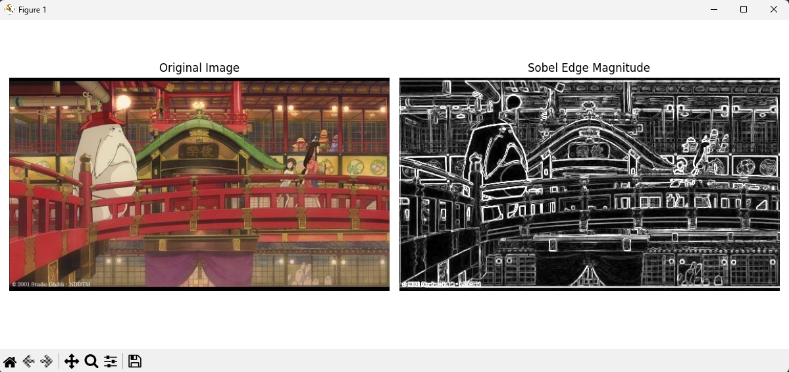

# 소벨 에지 검출 및 결과 시각화

## 문제

주어진 이미지 `edgeDetectionImage.jpg`를 불러와 그레이스케일로 변환한 뒤, Sobel 필터를 사용하여 x축과 y축 방향의 에지를 검출한다. 이후 두 방향의 에지 정보를 결합하여 에지 강도 이미지를 생성하고, 원본 이미지와 함께 시각화한다.

---

## 요구사항

* `cv.imread()`를 사용하여 이미지를 불러온다.
* `cv.cvtColor()`를 사용하여 그레이스케일 이미지로 변환한다.
* `cv.Sobel()`을 사용하여 x축과 y축 방향의 에지를 각각 검출한다.

  * x축: `cv.CV_64F, 1, 0`
  * y축: `cv.CV_64F, 0, 1`
* `cv.magnitude()`를 사용하여 에지 강도를 계산한다.
* `Matplotlib`을 사용하여 원본 이미지와 에지 강도 이미지를 나란히 시각화한다.
* 힌트에 따라 다음을 활용한다.

  * `ksize=3`
  * `cv.convertScaleAbs()`
  * `plt.imshow(..., cmap='gray')`

---

## 개념

### 1. 에지(Edge)란?

에지는 이미지 안에서 밝기 값이 급격하게 변하는 경계를 의미한다. 물체의 윤곽, 구조, 형태를 파악할 때 중요한 특징으로 사용된다.

### 2. Sobel 필터란?

Sobel 필터는 이미지의 미분 값을 이용하여 경계를 검출하는 대표적인 방법이다.

* `sobel_x`: x방향 미분으로 세로 경계를 강조
* `sobel_y`: y방향 미분으로 가로 경계를 강조

### 3. 에지 강도(Magnitude)

x방향과 y방향 에지를 따로 구한 뒤, 이를 결합하면 전체 에지의 강도를 계산할 수 있다.

```math
\text{Magnitude} = \sqrt{sobel_x^2 + sobel_y^2}
```

이 값이 클수록 해당 위치의 경계가 뚜렷하다는 의미이다.

---

## 전체 코드

```python
import cv2 as cv                  # OpenCV 기능을 사용하기 위해 불러옴 → 이미지 처리 가능
import matplotlib.pyplot as plt   # Matplotlib을 사용하기 위해 불러옴 → 결과 화면 출력 가능

# 1. 이미지 불러오기
img = cv.imread("images/edgeDetectionImage.jpg")  # 파일에서 이미지를 읽음 → 컬러 원본 이미지가 저장됨                                      # 프로그램을 종료함 → 이후 코드 실행을 막음

# 2. 그레이스케일 변환
gray = cv.cvtColor(img, cv.COLOR_BGR2GRAY)  # 컬러 이미지를 흑백으로 변환함 → 에지 검출이 쉬워짐

# 3. Sobel 필터로 x축, y축 방향 에지 검출
# 힌트에 따라 ksize=3 사용
sobel_x = cv.Sobel(gray, cv.CV_64F, 1, 0, ksize=3)  # x방향 변화량을 계산함 → 세로 경계가 강조됨
sobel_y = cv.Sobel(gray, cv.CV_64F, 0, 1, ksize=3)  # y방향 변화량을 계산함 → 가로 경계가 강조됨

# 4. 에지 강도(magnitude) 계산
magnitude = cv.magnitude(sobel_x, sobel_y)  # x,y 에지를 합쳐 강도를 계산함 → 전체 에지 세기가 구해짐

# 5. 시각화를 위해 uint8 형식으로 변환
edge_magnitude = cv.convertScaleAbs(magnitude)  # 결과를 8비트 영상으로 변환함 → 화면에 보기 쉽게 바뀜

# 6. Matplotlib으로 원본 이미지와 에지 강도 이미지 시각화
plt.figure(figsize=(12, 5))  # 출력 창 크기를 설정함 → 두 이미지를 넓게 비교 가능

# 원본 이미지 (OpenCV는 BGR이므로 RGB로 변환해서 출력)
plt.subplot(1, 2, 1)                           # 1행 2열 중 첫 번째 영역을 선택함 → 원본 이미지 위치가 정해짐
plt.imshow(cv.cvtColor(img, cv.COLOR_BGR2RGB)) # 원본을 RGB로 변환해 출력함 → 색상이 정상적으로 보임
plt.title("Original Image")                    # 첫 번째 이미지 제목을 설정함 → 원본임을 알 수 있음
plt.axis("off")                                # 축을 숨김 → 이미지에만 집중할 수 있음

# 에지 강도 이미지
plt.subplot(1, 2, 2)                      # 1행 2열 중 두 번째 영역을 선택함 → 에지 결과 위치가 정해짐
plt.imshow(edge_magnitude, cmap='gray')   # 에지 강도 영상을 흑백으로 출력함 → 경계가 선명하게 보임
plt.title("Sobel Edge Magnitude")         # 두 번째 이미지 제목을 설정함 → Sobel 결과임을 알 수 있음
plt.axis("off")                           # 축을 숨김 → 결과 이미지가 깔끔하게 보임

plt.tight_layout()  # 그래프 간격을 자동 조정함 → 제목과 이미지가 겹치지 않음
plt.show()          # 최종 결과 창을 화면에 표시함 → 원본과 에지 결과가 함께 나타남
```

---

## 핵심 코드

### 1. 그레이스케일 변환

컬러 이미지를 흑백으로 변환하여 밝기 변화만을 기준으로 에지를 검출할 수 있도록 한다.

```python
gray = cv.cvtColor(img, cv.COLOR_BGR2GRAY)
```

### 2. x축, y축 Sobel 에지 검출

x방향과 y방향으로 각각 경계 변화를 계산한다.

```python
sobel_x = cv.Sobel(gray, cv.CV_64F, 1, 0, ksize=3)
sobel_y = cv.Sobel(gray, cv.CV_64F, 0, 1, ksize=3)
```

### 3. 에지 강도 계산

두 방향의 에지를 결합하여 전체 경계 강도를 구한다.

```python
magnitude = cv.magnitude(sobel_x, sobel_y)
```

### 4. 시각화용 변환

실수 형태의 결과를 화면 출력이 가능한 8비트 영상으로 변환한다.

```python
edge_magnitude = cv.convertScaleAbs(magnitude)
```

---

## 실행 방법

### 1. 파일 준비

아래 두 파일을 같은 폴더에 저장한다.

* `01_sobel_edge.py`
* `edgeDetectionImage.jpg`

### 2. 실행

터미널 또는 명령 프롬프트에서 아래 명령어를 입력한다.

```bash
python 01_sobel_edge.py
```

### 3. 실행 환경

* Python 3.x
* OpenCV
* Matplotlib

필요한 라이브러리가 없다면 아래 명령어로 설치한다.

```bash
pip install opencv-python matplotlib
```

---

## 실행 결과

아래는 프로그램 실행 결과이다.
왼쪽에는 원본 이미지가 출력되고, 오른쪽에는 Sobel 필터를 적용한 에지 강도 이미지가 출력된다.



---

## 실행 결과 분석

이번 실험에서는 애니메이션 장면 이미지에 대해 Sobel 에지 검출을 수행하였다.

* 원본 이미지에는 다리, 건물, 기둥, 조명, 캐릭터 등 다양한 구조물이 포함되어 있다.
* Sobel 연산 결과, 밝기 변화가 큰 경계 부분이 흰색에 가깝게 강조되었다.
* 특히 다리의 난간, 건물의 외곽선, 창문 구조, 기둥, 캐릭터 윤곽선 등 선형 구조가 뚜렷하게 검출되었다.
* 반면 내부의 완만한 색 변화 영역은 에지가 약하게 나타나거나 거의 검출되지 않았다.

즉, Sobel 필터는 이미지에서 물체의 형태와 구조를 파악하는 데 효과적이며, 복잡한 장면에서도 윤곽선과 경계를 비교적 잘 추출할 수 있음을 확인할 수 있었다.

---
