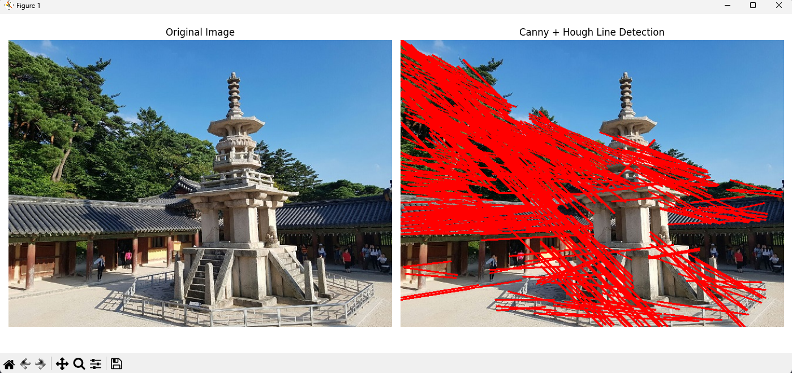
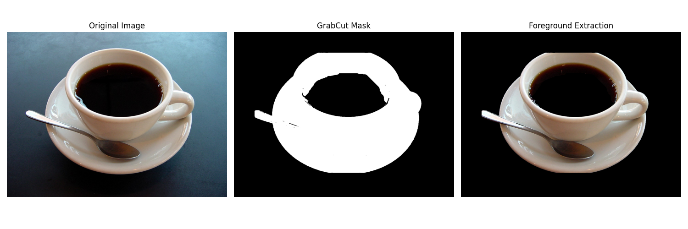

# 1. 소벨 에지 검출 및 결과 시각화

## 문제

주어진 이미지 `edgeDetectionImage.jpg`를 불러와 그레이스케일로 변환한 뒤, Sobel 필터를 사용하여 x축과 y축 방향의 에지를 검출한다. 이후 두 방향의 에지 정보를 결합하여 에지 강도 이미지를 생성하고, 원본 이미지와 함께 시각화한다.

---

## 요구사항

* `cv.imread()`를 사용하여 이미지를 불러온다.
* `cv.cvtColor()`를 사용하여 그레이스케일 이미지로 변환한다.
* `cv.Sobel()`을 사용하여 x축과 y축 방향의 에지를 각각 검출한다.

  * x축: `cv.CV_64F, 1, 0`
  * y축: `cv.CV_64F, 0, 1`
* `cv.magnitude()`를 사용하여 에지 강도를 계산한다.
* `Matplotlib`을 사용하여 원본 이미지와 에지 강도 이미지를 나란히 시각화한다.
* 힌트에 따라 다음을 활용한다.

  * `ksize=3`
  * `cv.convertScaleAbs()`
  * `plt.imshow(..., cmap='gray')`

---

## 개념

### 1. 에지(Edge)란?

에지는 이미지 안에서 밝기 값이 급격하게 변하는 경계를 의미한다. 물체의 윤곽, 구조, 형태를 파악할 때 중요한 특징으로 사용된다.

### 2. Sobel 필터란?

Sobel 필터는 이미지의 미분 값을 이용하여 경계를 검출하는 대표적인 방법이다.

* `sobel_x`: x방향 미분으로 세로 경계를 강조
* `sobel_y`: y방향 미분으로 가로 경계를 강조

### 3. 에지 강도(Magnitude)

x방향과 y방향 에지를 따로 구한 뒤, 이를 결합하면 전체 에지의 강도를 계산할 수 있다.

```math
\text{Magnitude} = \sqrt{sobel_x^2 + sobel_y^2}
```

이 값이 클수록 해당 위치의 경계가 뚜렷하다는 의미이다.

---

## 전체 코드

```python
import cv2 as cv                  # OpenCV 기능을 사용하기 위해 불러옴 → 이미지 처리 가능
import matplotlib.pyplot as plt   # Matplotlib을 사용하기 위해 불러옴 → 결과 화면 출력 가능

# 1. 이미지 불러오기
img = cv.imread("images/edgeDetectionImage.jpg")  # 파일에서 이미지를 읽음 → 컬러 원본 이미지가 저장됨                                      # 프로그램을 종료함 → 이후 코드 실행을 막음

# 2. 그레이스케일 변환
gray = cv.cvtColor(img, cv.COLOR_BGR2GRAY)  # 컬러 이미지를 흑백으로 변환함 → 에지 검출이 쉬워짐

# 3. Sobel 필터로 x축, y축 방향 에지 검출
# 힌트에 따라 ksize=3 사용
sobel_x = cv.Sobel(gray, cv.CV_64F, 1, 0, ksize=3)  # x방향 변화량을 계산함 → 세로 경계가 강조됨
sobel_y = cv.Sobel(gray, cv.CV_64F, 0, 1, ksize=3)  # y방향 변화량을 계산함 → 가로 경계가 강조됨

# 4. 에지 강도(magnitude) 계산
magnitude = cv.magnitude(sobel_x, sobel_y)  # x,y 에지를 합쳐 강도를 계산함 → 전체 에지 세기가 구해짐

# 5. 시각화를 위해 uint8 형식으로 변환
edge_magnitude = cv.convertScaleAbs(magnitude)  # 결과를 8비트 영상으로 변환함 → 화면에 보기 쉽게 바뀜

# 6. Matplotlib으로 원본 이미지와 에지 강도 이미지 시각화
plt.figure(figsize=(12, 5))  # 출력 창 크기를 설정함 → 두 이미지를 넓게 비교 가능

# 원본 이미지 (OpenCV는 BGR이므로 RGB로 변환해서 출력)
plt.subplot(1, 2, 1)                           # 1행 2열 중 첫 번째 영역을 선택함 → 원본 이미지 위치가 정해짐
plt.imshow(cv.cvtColor(img, cv.COLOR_BGR2RGB)) # 원본을 RGB로 변환해 출력함 → 색상이 정상적으로 보임
plt.title("Original Image")                    # 첫 번째 이미지 제목을 설정함 → 원본임을 알 수 있음
plt.axis("off")                                # 축을 숨김 → 이미지에만 집중할 수 있음

# 에지 강도 이미지
plt.subplot(1, 2, 2)                      # 1행 2열 중 두 번째 영역을 선택함 → 에지 결과 위치가 정해짐
plt.imshow(edge_magnitude, cmap='gray')   # 에지 강도 영상을 흑백으로 출력함 → 경계가 선명하게 보임
plt.title("Sobel Edge Magnitude")         # 두 번째 이미지 제목을 설정함 → Sobel 결과임을 알 수 있음
plt.axis("off")                           # 축을 숨김 → 결과 이미지가 깔끔하게 보임

plt.tight_layout()  # 그래프 간격을 자동 조정함 → 제목과 이미지가 겹치지 않음
plt.show()          # 최종 결과 창을 화면에 표시함 → 원본과 에지 결과가 함께 나타남
```

---

## 핵심 코드

### 1. 그레이스케일 변환

컬러 이미지를 흑백으로 변환하여 밝기 변화만을 기준으로 에지를 검출할 수 있도록 한다.

```python
gray = cv.cvtColor(img, cv.COLOR_BGR2GRAY)
```

### 2. x축, y축 Sobel 에지 검출

x방향과 y방향으로 각각 경계 변화를 계산한다.

```python
sobel_x = cv.Sobel(gray, cv.CV_64F, 1, 0, ksize=3)
sobel_y = cv.Sobel(gray, cv.CV_64F, 0, 1, ksize=3)
```

### 3. 에지 강도 계산

두 방향의 에지를 결합하여 전체 경계 강도를 구한다.

```python
magnitude = cv.magnitude(sobel_x, sobel_y)
```

### 4. 시각화용 변환

실수 형태의 결과를 화면 출력이 가능한 8비트 영상으로 변환한다.

```python
edge_magnitude = cv.convertScaleAbs(magnitude)
```

---

## 실행 방법

### 1. 파일 준비

아래 파일을 같은 프로젝트 폴더 구조에 맞게 준비한다.

* `01_sobel_edge.py`
* `images/edgeDetectionImage.jpg`

### 2. 실행

터미널 또는 명령 프롬프트에서 아래 명령어를 입력한다.

```bash
python 01_sobel_edge.py
```

### 3. 실행 환경

* Python 3.x
* OpenCV
* Matplotlib

필요한 라이브러리가 없다면 아래 명령어로 설치한다.

```bash
pip install opencv-python matplotlib
```

---

## 실행 결과

아래는 프로그램 실행 결과이다.
왼쪽에는 원본 이미지가 출력되고, 오른쪽에는 Sobel 필터를 적용한 에지 강도 이미지가 출력된다.


---

## 실행 결과 분석

이번 실험에서는 애니메이션 장면 이미지에 대해 Sobel 에지 검출을 수행하였다.

* 원본 이미지에는 다리, 건물, 기둥, 조명, 캐릭터 등 다양한 구조물이 포함되어 있다.
* Sobel 연산 결과, 밝기 변화가 큰 경계 부분이 흰색에 가깝게 강조되었다.
* 특히 다리의 난간, 건물의 외곽선, 창문 구조, 기둥, 캐릭터 윤곽선 등 선형 구조가 뚜렷하게 검출되었다.
* 반면 내부의 완만한 색 변화 영역은 에지가 약하게 나타나거나 거의 검출되지 않았다.

즉, Sobel 필터는 이미지에서 물체의 형태와 구조를 파악하는 데 효과적이며, 복잡한 장면에서도 윤곽선과 경계를 비교적 잘 추출할 수 있음을 확인할 수 있었다.

---


# 2. 캐니 에지 및 허프 변환을 이용한 직선 검출

## 문제

주어진 이미지 `dabo.jpg`에서 캐니(Canny) 에지 검출을 사용하여 에지 맵을 생성하고, 허프 변환(Hough Transform)을 이용해 직선을 검출한다. 이후 검출된 직선을 원본 이미지 위에 빨간색으로 표시하고, 원본 이미지와 결과 이미지를 나란히 시각화한다.

---

## 요구사항

* `cv.Canny()`를 사용하여 에지 맵을 생성한다.
* `cv.HoughLinesP()`를 사용하여 직선을 검출한다.
* `cv.line()`을 사용하여 검출된 직선을 원본 이미지에 그린다.
* `Matplotlib`을 사용하여 원본 이미지와 직선이 그려진 이미지를 나란히 시각화한다.
* 힌트에 따라 다음 값을 사용한다.

  * `cv.Canny()`의 `threshold1=100`, `threshold2=200`
  * `cv.line()`의 색상은 `(0, 0, 255)` (빨간색), 두께는 `2`
  * `cv.HoughLinesP()`의 `rho`, `theta`, `threshold`, `minLineLength`, `maxLineGap` 값을 조절하여 성능을 개선한다.

---

## 개념

### 1. 캐니 에지 검출(Canny Edge Detection)

캐니 에지 검출은 이미지에서 밝기 변화가 큰 부분을 찾아 경계를 추출하는 방법이다.
즉, 물체의 윤곽이나 구조적인 경계선을 찾는 데 사용된다.

### 2. 허프 변환(Hough Transform)

허프 변환은 에지 이미지에서 직선 형태를 찾는 방법이다.
특히 `cv.HoughLinesP()`는 확률적 허프 변환(Probabilistic Hough Transform)을 사용하여 직선의 시작점과 끝점을 직접 반환한다.

### 3. 직선 검출 과정

이 과제의 전체 흐름은 다음과 같다.

1. 컬러 이미지를 불러온다.
2. 그레이스케일로 변환한다.
3. Canny로 에지를 검출한다.
4. HoughLinesP로 직선을 찾는다.
5. 검출된 직선을 원본 이미지에 그린다.
6. 원본 이미지와 결과 이미지를 비교한다.

---

## 전체 코드

```python
import cv2 as cv                  # OpenCV 기능을 사용하기 위해 불러옴 → 이미지 처리와 직선 그리기가 가능해짐
import matplotlib.pyplot as plt   # Matplotlib을 사용하기 위해 불러옴 → 결과 이미지를 화면에 출력할 수 있음
import numpy as np                # NumPy를 사용하기 위해 불러옴 → 허프 변환 각도 값을 설정할 수 있음

# 1. 이미지 불러오기
img = cv.imread("images/dabo.jpg")  # 다보탑 이미지를 읽어옴 → 원본 컬러 이미지가 저장됨

# 2. 원본 이미지를 복사
line_img = img.copy()  # 원본을 복사함 → 직선을 그려도 원본 이미지는 유지됨

# 3. 그레이스케일 변환
gray = cv.cvtColor(img, cv.COLOR_BGR2GRAY)  # 컬러 이미지를 흑백으로 변환함 → 에지 검출이 쉬워짐

# 4. Canny 에지 검출
# 힌트에 따라 threshold1=100, threshold2=200 사용
edges = cv.Canny(gray, 100, 200)  # 밝기 변화가 큰 경계를 검출함 → 흰색 에지 맵이 생성됨

# 5. HoughLinesP를 사용하여 직선 검출
# rho, theta, threshold, minLineLength, maxLineGap 값을 조절
lines = cv.HoughLinesP(            # 에지 맵에서 직선 후보를 찾음 → 직선 좌표 정보가 반환됨
    edges,                         # 캐니 에지 결과를 입력함 → 경계선 기반으로 직선을 검출함
    rho=1,                         # 거리 해상도를 1픽셀로 설정함 → 세밀하게 직선을 탐색함
    theta=np.pi / 180,             # 각도 해상도를 1도로 설정함 → 다양한 방향의 직선을 검출함
    threshold=120,                 # 직선으로 인정할 최소 투표 수를 설정함 → 강한 직선만 남게 됨
    minLineLength=80,              # 최소 직선 길이를 설정함 → 너무 짧은 선은 제외됨
    maxLineGap=10                  # 선 사이 최대 간격을 설정함 → 끊긴 선을 하나로 연결할 수 있음
)

# 6. 검출된 직선을 원본 이미지에 그리기
if lines is not None:                          # 검출된 직선이 있는지 확인함 → 직선이 있을 때만 그림
    for line in lines:                        # 검출된 직선을 하나씩 꺼냄 → 모든 직선을 순서대로 처리함
        x1, y1, x2, y2 = line[0]             # 직선의 시작점과 끝점 좌표를 저장함 → 그릴 위치가 정해짐
        # 힌트에 따라 빨간색 (0, 0, 255), 두께 2 사용
        cv.line(line_img, (x1, y1), (x2, y2), (0, 0, 255), 2)  # 직선을 빨간색으로 그림 → 검출 결과가 원본 위에 표시됨

# 7. Matplotlib으로 원본 이미지와 직선 검출 결과 시각화
plt.figure(figsize=(14, 6))  # 출력 창 크기를 설정함 → 두 이미지를 넓게 비교할 수 있음

# 원본 이미지
plt.subplot(1, 2, 1)                           # 1행 2열 중 첫 번째 영역을 선택함 → 원본 이미지가 왼쪽에 배치됨
plt.imshow(cv.cvtColor(img, cv.COLOR_BGR2RGB)) # 원본 이미지를 RGB로 변환해 출력함 → 색상이 올바르게 보임
plt.title("Original Image")                    # 첫 번째 이미지 제목을 설정함 → 원본 이미지임을 알 수 있음
plt.axis("off")                                # 축을 숨김 → 이미지가 더 깔끔하게 보임

# 직선 검출 결과 이미지
plt.subplot(1, 2, 2)                                # 1행 2열 중 두 번째 영역을 선택함 → 결과 이미지가 오른쪽에 배치됨
plt.imshow(cv.cvtColor(line_img, cv.COLOR_BGR2RGB)) # 직선이 그려진 이미지를 RGB로 변환해 출력함 → 검출 결과가 정상 색상으로 보임
plt.title("Canny + Hough Line Detection")           # 두 번째 이미지 제목을 설정함 → 직선 검출 결과임을 알 수 있음
plt.axis("off")                                     # 축을 숨김 → 결과를 보기 쉽게 정리함

plt.tight_layout()  # 이미지와 제목 간격을 자동으로 조정함 → 화면 구성이 겹치지 않게 됨
plt.show()          # 최종 결과를 화면에 출력함 → 원본과 직선 검출 결과가 함께 나타남
```

---

## 핵심 코드

### 1. 캐니 에지 검출

그레이스케일 이미지에서 경계선을 추출한다.

```python
edges = cv.Canny(gray, 100, 200)
```

### 2. 허프 변환을 이용한 직선 검출

에지 맵을 기반으로 직선 후보를 찾는다.

```python
lines = cv.HoughLinesP(
    edges,
    rho=1,
    theta=np.pi / 180,
    threshold=120,
    minLineLength=80,
    maxLineGap=10
)
```

### 3. 검출된 직선을 원본 이미지에 표시

검출된 직선을 빨간색으로 그려 결과를 시각적으로 확인한다.

```python
if lines is not None:
    for line in lines:
        x1, y1, x2, y2 = line[0]
        cv.line(line_img, (x1, y1), (x2, y2), (0, 0, 255), 2)
```

---

## 실행 방법

### 1. 파일 준비

아래 파일을 같은 프로젝트 폴더 구조에 맞게 준비한다.

* `02_canny_hough.py`
* `images/dabo.jpg`

### 2. 실행 명령어

```bash
python 02_canny_hough.py
```

### 3. 필요한 라이브러리 설치

```bash
pip install opencv-python matplotlib numpy
```

---

## 실행 결과

프로그램을 실행하면 왼쪽에는 원본 이미지가 출력되고, 오른쪽에는 캐니 에지와 허프 변환을 통해 검출된 직선이 빨간색으로 표시된 결과 이미지가 출력된다.



---

## 실행 결과 분석

이번 실험에서는 다보탑 이미지에 대해 캐니 에지 검출과 허프 변환을 적용하여 직선을 검출하였다.

* 원본 이미지에는 석탑, 지붕, 난간, 계단 등 직선 구조가 많이 포함되어 있다.
* 캐니 에지 검출을 통해 이미지의 경계선이 추출되었고, 허프 변환은 이 경계선들 중 직선 형태를 찾아냈다.
* 결과 이미지에서는 검출된 직선이 빨간색으로 표시되어 구조적인 선들을 확인할 수 있었다.

다만, 현재 결과를 보면 직선이 너무 많이 검출되어 이미지 전반에 빨간 선이 과도하게 표시되었다.
이는 다음과 같은 이유로 볼 수 있다.

* 배경의 나뭇잎, 지붕 무늬, 그림자와 같은 복잡한 에지도 함께 검출되었기 때문
* `threshold`, `minLineLength`, `maxLineGap` 값이 현재 이미지에 비해 다소 민감하게 설정되었기 때문

즉, 직선 검출은 수행되었지만 원하는 주요 구조물만 깔끔하게 검출되었다고 보기는 어렵다.
보다 정확한 결과를 얻기 위해서는 다음과 같은 개선이 가능하다.

* `threshold` 값을 더 크게 조정하여 강한 직선만 남기기
* `minLineLength` 값을 늘려 짧은 선분 제거하기
* 필요하다면 블러(Blur)를 먼저 적용하여 불필요한 세부 에지를 줄이기

정리하면, 이번 결과는 **캐니와 허프 변환이 직선 검출에 효과적임을 보여주지만**, 파라미터 설정에 따라 과검출이 쉽게 발생할 수 있음을 확인한 실험이라고 볼 수 있다.

---

# 3. GrabCut을 이용한 대화식 영역 분할 및 객체 추출

## 문제

`coffee cup` 이미지를 대상으로 사용자가 지정한 초기 사각형 영역을 기준으로 GrabCut 알고리즘을 적용하여 객체를 추출한다.
분할 결과는 마스크 이미지로 시각화하고, 원본 이미지에서 배경을 제거한 객체 추출 결과를 함께 출력한다.

---

## 요구사항

* `cv.grabCut()`을 사용하여 대화식 분할을 수행한다.
* 초기 사각형 영역은 `(x, y, width, height)` 형식으로 설정한다.
* 마스크를 사용하여 원본 이미지에서 배경을 제거한다.
* `matplotlib`를 사용하여 원본 이미지, 마스크 이미지, 배경 제거 이미지를 나란히 시각화한다.
* 힌트에 따라 다음을 활용한다.

  * `bgdModel`, `fgdModel`은 `np.zeros((1, 65), np.float64)`로 초기화
  * 마스크 값은 `cv.GC_BGD`, `cv.GC_FGD`, `cv.GC_PR_BGD`, `cv.GC_PR_FGD` 개념 사용
  * `np.where()`를 사용하여 마스크를 0 또는 1로 변환 후 원본 이미지에 곱해 배경 제거

---

## 개념

### 1. GrabCut이란?

GrabCut은 이미지에서 전경과 배경을 분리하는 영역 분할 알고리즘이다.
사용자가 객체를 포함하는 대략적인 사각형 영역만 지정하면, 알고리즘이 그 안의 전경과 바깥의 배경을 반복적으로 구분하여 객체를 추출한다.

### 2. 마스크(Mask)

GrabCut은 각 픽셀이 배경인지 전경인지에 대한 정보를 마스크에 저장한다.
주요 마스크 값은 다음과 같다.

* `cv.GC_BGD`: 확실한 배경
* `cv.GC_FGD`: 확실한 전경
* `cv.GC_PR_BGD`: 배경일 가능성이 큰 영역
* `cv.GC_PR_FGD`: 전경일 가능성이 큰 영역

이 과제에서는 확실한 배경과 배경 가능 영역을 `0`, 나머지를 `1`로 바꾸어 객체만 남기도록 했다.

### 3. 객체 추출 방식

GrabCut으로 얻은 마스크를 0과 1의 이진 마스크로 바꾼 후, 이를 원본 이미지에 곱하면 배경은 제거되고 전경 객체만 남게 된다.

---

## 전체 코드

```python
import cv2 as cv                           # OpenCV 기능을 사용하기 위해 불러옴 → 이미지 읽기와 GrabCut 수행 가능
import numpy as np                         # NumPy 기능을 사용하기 위해 불러옴 → 마스크 계산과 배열 연산 가능
import matplotlib.pyplot as plt            # Matplotlib을 사용하기 위해 불러옴 → 결과 이미지를 화면에 출력 가능

img = cv.imread("images/coffee cup.JPG")   # images 폴더에서 커피컵 이미지를 읽어옴 → 원본 컬러 이미지가 저장됨

mask = np.zeros(img.shape[:2], np.uint8)   # 이미지 크기와 같은 2차원 마스크를 생성함 → 초기 분할용 빈 마스크가 만들어짐
bgdModel = np.zeros((1, 65), np.float64)   # 배경 모델 배열을 0으로 초기화함 → GrabCut이 배경 정보를 저장할 준비를 함
fgdModel = np.zeros((1, 65), np.float64)   # 전경 모델 배열을 0으로 초기화함 → GrabCut이 객체 정보를 저장할 준비를 함

rect = (120, 120, 1040, 750)               # 초기 사각형 영역을 지정함 → 컵과 접시가 포함된 전경 후보 영역이 설정됨

cv.grabCut(                                # GrabCut 알고리즘을 실행함 → 사각형 기준으로 전경/배경이 분할됨
    img,                                   # 원본 이미지를 입력함 → 분할 기준이 되는 실제 영상이 사용됨
    mask,                                  # 초기 마스크를 입력함 → 분할 결과가 이 마스크에 저장됨
    rect,                                  # 초기 사각형 영역을 입력함 → 이 영역을 중심으로 객체를 추출함
    bgdModel,                              # 배경 모델을 입력함 → 배경 통계 정보가 갱신됨
    fgdModel,                              # 전경 모델을 입력함 → 객체 통계 정보가 갱신됨
    5,                                     # 반복 횟수를 5로 설정함 → 분할 결과가 더 안정적으로 계산됨
    cv.GC_INIT_WITH_RECT                   # 사각형 기반 초기화를 사용함 → 지정한 영역으로 GrabCut을 시작함
)

mask2 = np.where(                          # GrabCut 마스크 값을 0과 1로 바꿈 → 배경 제거용 이진 마스크가 생성됨
    (mask == cv.GC_BGD) | (mask == cv.GC_PR_BGD),  # 확실한 배경과 배경일 가능성이 큰 영역을 찾음 → 제거할 부분이 선택됨
    0,                                     # 배경은 0으로 설정함 → 결과 이미지에서 사라지게 됨
    1                                      # 전경은 1로 설정함 → 결과 이미지에서 남게 됨
).astype("uint8")                          # 마스크를 uint8 형식으로 변환함 → 이미지 연산에 바로 사용 가능해짐

result = img * mask2[:, :, np.newaxis]     # 이진 마스크를 원본 이미지에 곱함 → 배경이 제거되고 객체만 남음

plt.figure(figsize=(15, 5))                # 출력 창 크기를 설정함 → 세 개의 이미지를 나란히 보기 좋게 만듦

plt.subplot(1, 3, 1)                       # 1행 3열 중 첫 번째 영역을 선택함 → 원본 이미지가 왼쪽에 표시됨
plt.imshow(cv.cvtColor(img, cv.COLOR_BGR2RGB))  # 원본 이미지를 RGB로 변환해 출력함 → 색상이 정상적으로 보임
plt.title("Original Image")                # 첫 번째 이미지 제목을 설정함 → 원본 이미지임을 알 수 있음
plt.axis("off")                            # 축을 숨김 → 이미지가 더 깔끔하게 보임

plt.subplot(1, 3, 2)                       # 1행 3열 중 두 번째 영역을 선택함 → 마스크 이미지가 가운데에 표시됨
plt.imshow(mask2 * 255, cmap="gray")       # 이진 마스크를 흑백으로 출력함 → 객체 영역은 흰색, 배경은 검은색으로 보임
plt.title("GrabCut Mask")                  # 두 번째 이미지 제목을 설정함 → GrabCut 마스크 결과임을 알 수 있음
plt.axis("off")                            # 축을 숨김 → 마스크 결과를 보기 쉽게 만듦

plt.subplot(1, 3, 3)                       # 1행 3열 중 세 번째 영역을 선택함 → 배경 제거 결과가 오른쪽에 표시됨
plt.imshow(cv.cvtColor(result, cv.COLOR_BGR2RGB))  # 배경 제거 결과를 RGB로 변환해 출력함 → 객체만 남은 이미지가 보임
plt.title("Foreground Extraction")         # 세 번째 이미지 제목을 설정함 → 객체 추출 결과임을 알 수 있음
plt.axis("off")                            # 축을 숨김 → 최종 결과가 깔끔하게 보임

plt.tight_layout()                         # 이미지와 제목 간격을 자동 조정함 → 화면 구성이 겹치지 않음
plt.show()                                 # 최종 결과를 화면에 출력함 → 원본, 마스크, 객체 추출 결과가 함께 나타남
```

---

## 핵심 코드

### 1. 초기 마스크와 모델 생성

GrabCut을 수행하기 위해 빈 마스크와 배경/전경 모델을 초기화한다.

```python
mask = np.zeros(img.shape[:2], np.uint8)
bgdModel = np.zeros((1, 65), np.float64)
fgdModel = np.zeros((1, 65), np.float64)
```

### 2. 초기 사각형 영역 설정

객체가 포함된 대략적인 영역을 지정하여 GrabCut이 전경 후보를 판단하도록 한다.

```python
rect = (120, 120, 1040, 700)
```

### 3. GrabCut 수행

지정한 사각형 영역을 기반으로 전경과 배경을 분리한다.

```python
cv.grabCut(
    img,
    mask,
    rect,
    bgdModel,
    fgdModel,
    5,
    cv.GC_INIT_WITH_RECT
)
```

### 4. 마스크를 이진화하여 배경 제거

배경 영역은 0, 전경 영역은 1로 바꾼 뒤 원본 이미지에 적용한다.

```python
mask2 = np.where(
    (mask == cv.GC_BGD) | (mask == cv.GC_PR_BGD),
    0,
    1
).astype("uint8")

result = img * mask2[:, :, np.newaxis]
```

---

## 실행 방법

### 1. 파일 준비

다음과 같은 폴더 구조로 파일을 준비한다.

```bash
project/
 ┣ 03_grabcut.py
 ┗ images/
    ┗ coffee cup.JPG
```

### 2. 실행 명령어

터미널 또는 명령 프롬프트에서 아래 명령어를 입력한다.

```bash
python 03_grabcut.py
```

### 3. 필요한 라이브러리 설치

필요한 라이브러리가 없다면 아래 명령어로 설치한다.

```bash
pip install opencv-python matplotlib numpy
```

---

## 실행 결과

프로그램을 실행하면 다음과 같이 3개의 이미지가 나란히 출력된다.

1. **Original Image**
   원본 커피컵 이미지

2. **GrabCut Mask**
   GrabCut으로 분할한 마스크 이미지

   * 흰색: 전경(객체)
   * 검은색: 배경

3. **Foreground Extraction**
   마스크를 원본에 적용하여 배경을 제거한 결과 이미지



---

## 실행 결과 분석

이번 실험에서는 커피컵 이미지에 GrabCut 알고리즘을 적용하여 객체를 추출하였다.

* 원본 이미지에서는 컵, 접시, 스푼, 배경 테이블이 함께 포함되어 있다.
* GrabCut 마스크 결과를 보면 컵, 접시, 스푼이 흰색 영역으로 분리되었고, 배경은 대부분 검은색으로 제거되었다.
* 최종 결과 이미지에서는 테이블 배경이 제거되고 컵과 접시, 스푼만 남아 객체 추출이 성공적으로 이루어진 것을 확인할 수 있다.

특히 이번 결과에서는 다음과 같은 점을 확인할 수 있다.

* 컵과 접시처럼 경계가 비교적 뚜렷한 물체는 잘 분리되었다.
* 스푼도 함께 전경으로 인식되어 객체에 포함되었다.
* 배경이 어두운 단색에 가까워서 전경과 배경 구분이 비교적 잘 이루어졌다.

다만, GrabCut은 초기 사각형 영역에 영향을 많이 받기 때문에, 사각형이 너무 좁거나 넓으면 분할 결과가 달라질 수 있다.
즉, 이번 결과는 초기 사각형을 적절히 지정했기 때문에 비교적 정확한 객체 추출이 가능했던 사례라고 볼 수 있다.

정리하면, GrabCut은 사용자가 대략적인 영역만 지정해도 전경 객체를 효과적으로 분리할 수 있는 알고리즘이며, 배경 제거와 객체 추출 문제에 매우 유용하다는 것을 확인할 수 있었다.

---
