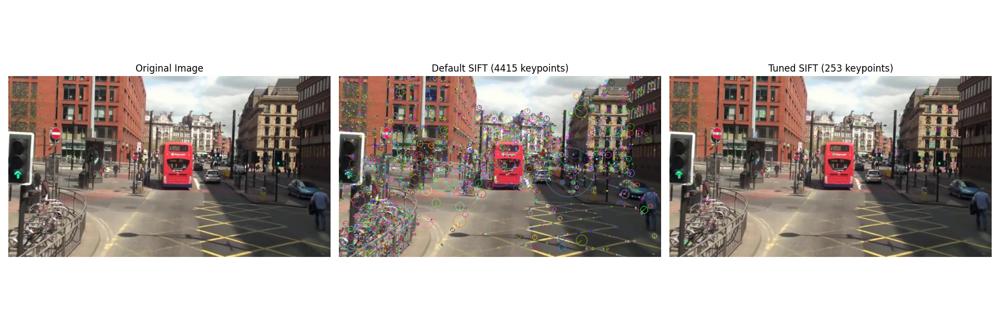
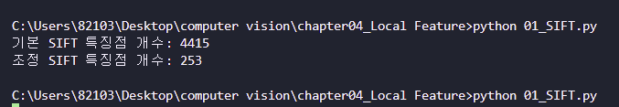
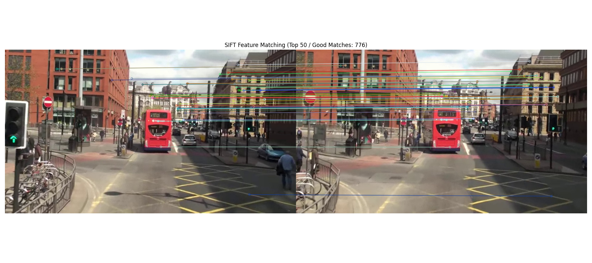
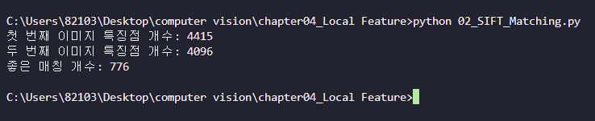

# 01. SIFT를 이용한 특징점 검출 및 시각화

## 문제

주어진 이미지 `mot_color70.jpg`에 대해 SIFT(Scale-Invariant Feature Transform) 알고리즘을 적용하여 특징점을 검출하고, 이를 시각화하는 프로그램을 작성한다.
또한 SIFT의 기본 설정 결과와 매개변수를 조정한 결과를 비교하여 특징점 검출 개수와 분포의 차이를 확인한다.

---

## 요구사항

* `cv.SIFT_create()`를 사용하여 SIFT 객체를 생성할 것
* `detectAndCompute()`를 사용하여 특징점을 검출할 것
* `cv.drawKeypoints()`를 사용하여 특징점을 이미지 위에 시각화할 것
* `matplotlib`을 이용하여 원본 이미지와 특징점 시각화 결과를 나란히 출력할 것
* 힌트에 따라 SIFT의 매개변수를 조정하여 결과를 비교할 것
* `flags=cv.DRAW_MATCHES_FLAGS_DRAW_RICH_KEYPOINTS`를 사용하여 특징점의 크기와 방향도 함께 표현할 것

---

## 개념

### 1. SIFT란?

SIFT는 이미지에서 회전, 크기 변화, 일부 조명 변화에도 비교적 강인한 특징점을 찾는 알고리즘이다.
이미지의 코너, 윤곽선, 패턴이 풍부한 지점 등을 특징점으로 검출하고, 각 특징점에 대한 기술자(descriptor)를 생성한다.

### 2. detectAndCompute()

`detectAndCompute()`는 이미지에서 특징점을 검출하고, 각 특징점에 대한 descriptor를 동시에 계산하는 함수이다.

* `kp`: 검출된 특징점 목록
* `des`: 각 특징점에 대한 descriptor 벡터

### 3. drawKeypoints()

`cv.drawKeypoints()`는 검출된 특징점을 원본 이미지 위에 표시하는 함수이다.
특히 `cv.DRAW_MATCHES_FLAGS_DRAW_RICH_KEYPOINTS` 옵션을 사용하면 다음 정보가 함께 표현된다.

* 특징점의 위치
* 특징점의 크기
* 특징점의 방향

### 4. 매개변수 조정의 의미

이번 과제에서는 기본 SIFT 결과와 함께 `nfeatures=250`, `contrastThreshold=0.03`으로 조정한 결과도 비교하였다.

* `nfeatures`: 검출할 특징점 수를 제한하는 데 사용
* `contrastThreshold`: 대비가 낮은 약한 특징점을 얼마나 걸러낼지 결정

즉, 기본 설정은 많은 특징점을 검출하고, 조정된 설정은 더 중요한 특징점 위주로 정리된 결과를 보여준다.

---

## 전체 코드

```python
import cv2 as cv  # OpenCV를 불러오는 이유 -> SIFT 생성, 특징점 검출, 특징점 시각화를 수행할 수 있음
import matplotlib.pyplot as plt  # matplotlib를 불러오는 이유 -> 원본 이미지와 결과 이미지를 나란히 출력할 수 있음
from pathlib import Path  # Path를 불러오는 이유 -> 실행 위치가 달라도 이미지 경로를 안정적으로 찾을 수 있음

img_path = Path("images/mot_color70.jpg")  # 기본 이미지 경로를 만드는 이유 -> 과제 이미지 mot_color70.jpg를 읽기 위함

img = cv.imread(str(img_path))  # 컬러 이미지를 읽는 이유 -> 원본 장면에서 SIFT 특징점을 검출하기 위함

gray = cv.cvtColor(img, cv.COLOR_BGR2GRAY)  # 그레이스케일로 변환하는 이유 -> SIFT가 밝기 정보를 기준으로 특징점을 검출하기 때문임

sift_default = cv.SIFT_create()  # 기본 SIFT 객체를 만드는 이유 -> 기준이 되는 기본 검출 결과를 확인할 수 있음
kp_default, des_default = sift_default.detectAndCompute(gray, None)  # 기본 설정으로 특징점과 기술자를 구하는 이유 -> 기본 SIFT 결과가 계산됨

sift_tuned = cv.SIFT_create(nfeatures=250, contrastThreshold=0.03)  # 매개변수를 조정하는 이유 -> 특징점 개수를 제한하고 검출 결과를 비교할 수 있음
kp_tuned, des_tuned = sift_tuned.detectAndCompute(gray, None)  # 조정된 설정으로 특징점과 기술자를 구하는 이유 -> 더 정돈된 특징점 결과가 계산됨

img_default_kp = cv.drawKeypoints(img, kp_default, None, flags=cv.DRAW_MATCHES_FLAGS_DRAW_RICH_KEYPOINTS)  # 기본 특징점을 그리는 이유 -> 특징점의 위치, 크기, 방향이 시각화된 이미지가 생성됨
img_tuned_kp = cv.drawKeypoints(img, kp_tuned, None, flags=cv.DRAW_MATCHES_FLAGS_DRAW_RICH_KEYPOINTS)  # 조정된 특징점을 그리는 이유 -> 제한된 특징점의 위치, 크기, 방향이 시각화된 이미지가 생성됨

img_rgb = cv.cvtColor(img, cv.COLOR_BGR2RGB)  # 원본 이미지를 RGB로 바꾸는 이유 -> matplotlib에서 색이 올바르게 표시됨
img_default_kp_rgb = cv.cvtColor(img_default_kp, cv.COLOR_BGR2RGB)  # 기본 결과 이미지를 RGB로 바꾸는 이유 -> matplotlib에서 색이 정상적으로 보임
img_tuned_kp_rgb = cv.cvtColor(img_tuned_kp, cv.COLOR_BGR2RGB)  # 조정 결과 이미지를 RGB로 바꾸는 이유 -> matplotlib에서 색이 정상적으로 보임

plt.figure(figsize=(18, 6))  # 큰 출력 창을 만드는 이유 -> 원본과 두 결과를 한 화면에서 보기 좋게 표시할 수 있음

plt.subplot(1, 3, 1)  # 첫 번째 영역을 만드는 이유 -> 원본 이미지를 배치할 위치가 만들어짐
plt.imshow(img_rgb)  # 원본 이미지를 출력하는 이유 -> 특징점 검출 전 장면을 확인할 수 있음
plt.title("Original Image")  # 제목을 붙이는 이유 -> 어떤 이미지인지 바로 구분할 수 있음
plt.axis("off")  # 축을 숨기는 이유 -> 이미지 자체에 집중해서 볼 수 있음

plt.subplot(1, 3, 2)  # 두 번째 영역을 만드는 이유 -> 기본 SIFT 결과를 배치할 위치가 만들어짐
plt.imshow(img_default_kp_rgb)  # 기본 SIFT 결과를 출력하는 이유 -> 기본 설정으로 검출된 특징점을 확인할 수 있음
plt.title(f"Default SIFT ({len(kp_default)} keypoints)")  # 특징점 개수를 제목에 넣는 이유 -> 기본 결과의 검출량을 바로 비교할 수 있음
plt.axis("off")  # 축을 숨기는 이유 -> 특징점 시각화 결과가 더 잘 보이게 함

plt.subplot(1, 3, 3)  # 세 번째 영역을 만드는 이유 -> 조정된 SIFT 결과를 배치할 위치가 만들어짐
plt.imshow(img_tuned_kp_rgb)  # 조정된 SIFT 결과를 출력하는 이유 -> nfeatures를 제한한 검출 결과를 확인할 수 있음
plt.title(f"Tuned SIFT ({len(kp_tuned)} keypoints)")  # 특징점 개수를 제목에 넣는 이유 -> 조정 결과의 검출량을 바로 비교할 수 있음
plt.axis("off")  # 축을 숨기는 이유 -> 특징점 결과를 더 깔끔하게 볼 수 있음

plt.tight_layout()  # 여백을 자동 정리하는 이유 -> 제목과 이미지가 겹치지 않고 정돈되어 보임
plt.show()  # 최종 결과를 화면에 띄우는 이유 -> 원본과 두 SIFT 결과를 한 번에 확인할 수 있음

print(f"기본 SIFT 특징점 개수: {len(kp_default)}")  # 기본 특징점 수를 출력하는 이유 -> 텍스트로도 결과를 확인할 수 있음
print(f"조정 SIFT 특징점 개수: {len(kp_tuned)}")  # 조정 특징점 수를 출력하는 이유 -> 파라미터 변경 효과를 수치로 비교할 수 있음
```

---

## 핵심 코드

### 1. SIFT 객체 생성 및 특징점 검출

```python
sift_default = cv.SIFT_create()
kp_default, des_default = sift_default.detectAndCompute(gray, None)

sift_tuned = cv.SIFT_create(nfeatures=250, contrastThreshold=0.03)
kp_tuned, des_tuned = sift_tuned.detectAndCompute(gray, None)
```

이 부분은 SIFT 객체를 생성하고, 이미지에서 특징점과 descriptor를 추출하는 핵심 코드이다.
기본 설정과 조정된 설정을 각각 적용하여 결과를 비교할 수 있도록 하였다.

### 2. 특징점 시각화

```python
img_default_kp = cv.drawKeypoints(
    img, kp_default, None,
    flags=cv.DRAW_MATCHES_FLAGS_DRAW_RICH_KEYPOINTS
)

img_tuned_kp = cv.drawKeypoints(
    img, kp_tuned, None,
    flags=cv.DRAW_MATCHES_FLAGS_DRAW_RICH_KEYPOINTS
)
```

이 부분은 검출된 특징점을 원본 이미지 위에 그리는 코드이다.
`DRAW_RICH_KEYPOINTS` 옵션을 사용하여 특징점의 위치뿐 아니라 크기와 방향까지 함께 표시하였다.

### 3. 결과 비교 출력

```python
plt.subplot(1, 3, 1)
plt.imshow(img_rgb)
plt.title("Original Image")

plt.subplot(1, 3, 2)
plt.imshow(img_default_kp_rgb)
plt.title(f"Default SIFT ({len(kp_default)} keypoints)")

plt.subplot(1, 3, 3)
plt.imshow(img_tuned_kp_rgb)
plt.title(f"Tuned SIFT ({len(kp_tuned)} keypoints)")
```

이 부분은 원본 이미지, 기본 SIFT 결과, 조정된 SIFT 결과를 한 화면에 나란히 출력하는 코드이다.
이를 통해 특징점의 수와 분포 차이를 쉽게 비교할 수 있다.

---

## 실행 방법

### 1. 파일 준비

* 파이썬 파일: `01_SIFT.py`
* 입력 이미지: `images/mot_color70.jpg`

### 2. 필요한 라이브러리 설치

```bash
pip install opencv-python matplotlib
```

### 3. 프로그램 실행

```bash
python 01_SIFT.py
```

---

## 실행 결과

실행 결과, 콘솔에는 다음과 같이 특징점 개수가 출력되었다.

```bash
기본 SIFT 특징점 개수: 4415
조정 SIFT 특징점 개수: 253
```

또한 하나의 화면에 다음 세 가지 이미지가 나란히 출력되었다.

1. 원본 이미지
2. 기본 SIFT 결과 이미지
3. 조정된 SIFT 결과 이미지

이미지 설명:

* 원본 이미지: 도심 도로 장면
* 기본 SIFT 결과: 건물 창문, 도로 표시, 버스 주변, 신호등 주변 등 텍스처가 많은 영역에 매우 많은 특징점이 검출됨
* 조정 SIFT 결과: 상대적으로 중요한 구조적 지점 위주로 특징점이 정리되어 표시됨




---

## 실행 결과 분석

이번 실험에서는 같은 이미지에 대해 기본 SIFT와 매개변수를 조정한 SIFT를 비교하였다.

기본 SIFT는 총 **4415개**의 특징점을 검출하였다.
이 결과에서는 건물 외벽, 창문, 도로의 노란 선, 자전거, 신호등, 버스 주변처럼 패턴과 경계가 많은 부분에 특징점이 매우 촘촘하게 분포하는 것을 확인할 수 있었다.
특징점이 많기 때문에 이미지의 세부 정보를 풍부하게 표현할 수 있다는 장점이 있지만, 시각적으로 다소 복잡하고 불필요하게 많은 특징점이 포함될 수 있다.

반면, `nfeatures=250`, `contrastThreshold=0.03`으로 조정한 경우에는 총 **253개**의 특징점이 검출되었다.
이 결과에서는 이미지 전체에 무분별하게 많은 점이 찍히기보다는, 비교적 중요한 모서리나 구조적 특징이 있는 위치에 특징점이 집중되었다.
따라서 결과가 훨씬 깔끔하게 보이고, 주요 특징을 확인하기 쉬웠다.

즉, 기본 설정은 **풍부한 특징 정보 확보**에 유리하고, 조정된 설정은 **핵심 특징만 선별하여 직관적으로 확인**하는 데 유리하다고 볼 수 있다.
이번 실험을 통해 SIFT의 매개변수 조정이 특징점의 개수와 시각적 해석에 큰 영향을 준다는 점을 확인할 수 있었다.

---

# 02. SIFT를 이용한 두 영상 간 특징점 매칭

## 문제

두 개의 입력 이미지 `mot_color70.jpg`와 `mot_color83.jpg`에 대해 SIFT(Scale-Invariant Feature Transform) 특징점을 추출한 뒤, 두 이미지 사이의 대응되는 특징점을 매칭하고 이를 시각화하는 프로그램을 작성한다.
또한 FLANN 기반 매칭과 최근접 이웃 거리 비율 검사(ratio test)를 적용하여 신뢰도 높은 매칭 결과를 확인한다.

---

## 요구사항

* `cv.imread()`를 사용하여 두 개의 이미지를 불러올 것
* `cv.SIFT_create()`를 사용하여 각 이미지의 특징점을 추출할 것
* `cv.BFMatcher()` 또는 `cv.FlannBasedMatcher()`를 사용하여 두 영상 간 특징점을 매칭할 것
* `cv.drawMatches()`를 사용하여 매칭 결과를 시각화할 것
* `matplotlib`을 이용하여 매칭 결과를 출력할 것
* 힌트에 따라 `knnMatch()`와 최근접 이웃 거리 비율 검사를 활용할 것

---

## 개념

### 1. SIFT 특징점

SIFT는 이미지의 크기 변화, 회전, 일부 조명 변화에도 비교적 강인하게 동작하는 특징점 검출 알고리즘이다.
각 이미지에서 특징점(keypoint)과 descriptor를 추출하여, 서로 다른 이미지 간 유사한 지점을 비교할 수 있다.

### 2. 특징점 매칭

두 이미지에서 추출한 descriptor를 비교하여 서로 가장 비슷한 특징점 쌍을 찾는 과정이다.
이번 과제에서는 FLANN(Approximate Nearest Neighbor 기반 탐색)을 사용해 빠르게 유사한 descriptor를 찾았다.

### 3. FLANN 기반 매칭

`cv.FlannBasedMatcher()`는 많은 descriptor를 효율적으로 비교하기 위한 매처이다.
SIFT descriptor는 실수형 벡터이므로 KD-Tree 기반 탐색이 적합하다.

* `algorithm=1`: KD-Tree 사용
* `trees=5`: 트리 개수 설정
* `checks=50`: 탐색 시 확인 횟수 설정

### 4. knnMatch()와 Ratio Test

`knnMatch(des1, des2, k=2)`는 각 descriptor에 대해 가장 가까운 이웃 2개를 찾는다.
이후 Lowe의 ratio test를 적용하여, 첫 번째 최근접 이웃이 두 번째보다 충분히 가까운 경우만 좋은 매칭으로 인정한다.

조건식:

```python id="ql61d4"
if m.distance < 0.75 * n.distance:
```

이 방식은 잘못된 대응점을 줄이고 더 신뢰도 높은 매칭 결과를 얻는 데 도움이 된다.

---

## 전체 코드

```python id="y8nqbw"
import cv2 as cv  # OpenCV를 불러오는 이유 -> 이미지 읽기, SIFT 특징점 추출, 특징점 매칭, 결과 시각화를 수행할 수 있음
import matplotlib.pyplot as plt  # matplotlib를 불러오는 이유 -> 두 이미지의 매칭 결과를 화면에 출력할 수 있음
from pathlib import Path  # Path를 불러오는 이유 -> 이미지 파일 경로를 안정적으로 지정할 수 있음

img1_path = Path("images/mot_color70.jpg")  # 첫 번째 이미지 경로를 지정하는 이유 -> 기준 이미지 mot_color70.jpg를 불러오기 위함
img2_path = Path("images/mot_color83.jpg")  # 두 번째 이미지 경로를 지정하는 이유 -> 비교 이미지 mot_color83.jpg를 불러오기 위함

img1 = cv.imread(str(img1_path))  # 첫 번째 이미지를 읽는 이유 -> 첫 번째 영상에서 특징점을 검출하기 위함
img2 = cv.imread(str(img2_path))  # 두 번째 이미지를 읽는 이유 -> 두 번째 영상에서 특징점을 검출하기 위함

gray1 = cv.cvtColor(img1, cv.COLOR_BGR2GRAY)  # 첫 번째 이미지를 그레이스케일로 변환하는 이유 -> SIFT가 밝기 정보 기반으로 특징점을 검출하기 때문임
gray2 = cv.cvtColor(img2, cv.COLOR_BGR2GRAY)  # 두 번째 이미지를 그레이스케일로 변환하는 이유 -> 두 영상에서 같은 방식으로 특징점을 검출하기 위함

sift = cv.SIFT_create()  # SIFT 객체를 생성하는 이유 -> 두 이미지에서 SIFT 특징점과 descriptor를 추출할 수 있음

kp1, des1 = sift.detectAndCompute(gray1, None)  # 첫 번째 이미지의 특징점과 descriptor를 구하는 이유 -> 매칭에 사용할 기준 정보가 계산됨
kp2, des2 = sift.detectAndCompute(gray2, None)  # 두 번째 이미지의 특징점과 descriptor를 구하는 이유 -> 비교 대상 정보가 계산됨

index_params = dict(algorithm=1, trees=5)  # FLANN 인덱스 파라미터를 설정하는 이유 -> KD-Tree 기반으로 SIFT descriptor를 빠르게 탐색할 수 있음
search_params = dict(checks=50)  # FLANN 검색 파라미터를 설정하는 이유 -> 최근접 이웃 탐색 정확도를 높일 수 있음

flann = cv.FlannBasedMatcher(index_params, search_params)  # FLANN 매처를 생성하는 이유 -> 두 이미지의 descriptor를 효율적으로 매칭할 수 있음
knn_matches = flann.knnMatch(des1, des2, k=2)  # 각 특징점마다 최근접 이웃 2개를 찾는 이유 -> ratio test를 적용할 수 있는 매칭 결과가 생성됨

good_matches = []  # 좋은 매칭만 저장할 리스트를 만드는 이유 -> 부정확한 매칭을 걸러낸 결과를 따로 관리할 수 있음

for m, n in knn_matches:  # 최근접 이웃 2개를 순회하는 이유 -> 각 특징점 쌍에 대해 ratio test를 적용할 수 있음
    if m.distance < 0.75 * n.distance:  # ratio test를 적용하는 이유 -> 가장 가까운 매칭이 두 번째보다 충분히 좋을 때만 신뢰할 수 있음
        good_matches.append(m)  # 좋은 매칭만 추가하는 이유 -> 더 정확한 특징점 매칭 결과가 저장됨

good_matches = sorted(good_matches, key=lambda x: x.distance)  # 거리 기준으로 정렬하는 이유 -> 더 유사한 매칭이 앞쪽에 오도록 정리할 수 있음
top_matches = good_matches[:50]  # 상위 매칭 일부만 선택하는 이유 -> 너무 많은 선이 그려지지 않아 결과를 보기 쉽게 만들 수 있음

match_img = cv.drawMatches(  # 매칭 결과 이미지를 생성하는 이유 -> 두 이미지 사이의 대응 특징점을 선으로 연결해 시각화할 수 있음
    img1, kp1, img2, kp2, top_matches, None, flags=cv.DrawMatchesFlags_NOT_DRAW_SINGLE_POINTS  # 좋은 매칭만 표시하는 이유 -> 신뢰도 높은 대응점만 깔끔하게 확인할 수 있음
)

match_img_rgb = cv.cvtColor(match_img, cv.COLOR_BGR2RGB)  # 결과 이미지를 RGB로 변환하는 이유 -> matplotlib에서 색이 올바르게 보이게 할 수 있음

plt.figure(figsize=(18, 8))  # 큰 출력 창을 만드는 이유 -> 두 이미지와 매칭 선들을 넓게 보기 좋게 표시할 수 있음
plt.imshow(match_img_rgb)  # 매칭 결과를 출력하는 이유 -> 두 영상 간 특징점 매칭 결과를 시각적으로 확인할 수 있음
plt.title(f"SIFT Feature Matching (Top 50 / Good Matches: {len(good_matches)})")  # 제목을 붙이는 이유 -> 좋은 매칭 개수와 출력 내용이 무엇인지 바로 알 수 있음
plt.axis("off")  # 축을 숨기는 이유 -> 이미지와 매칭 선 자체에 집중해서 볼 수 있음
plt.tight_layout()  # 레이아웃을 정리하는 이유 -> 제목과 이미지가 겹치지 않고 깔끔하게 출력됨
plt.show()  # 결과 창을 띄우는 이유 -> 최종 매칭 결과를 화면에서 확인할 수 있음

print(f"첫 번째 이미지 특징점 개수: {len(kp1)}")  # 첫 번째 이미지 특징점 수를 출력하는 이유 -> 검출된 특징점 양을 수치로 확인할 수 있음
print(f"두 번째 이미지 특징점 개수: {len(kp2)}")  # 두 번째 이미지 특징점 수를 출력하는 이유 -> 비교 이미지의 특징점 양을 수치로 확인할 수 있음
print(f"좋은 매칭 개수: {len(good_matches)}")  # 좋은 매칭 수를 출력하는 이유 -> ratio test 후 남은 신뢰도 높은 매칭 수를 확인할 수 있음
```

---

## 핵심 코드

### 1. SIFT 특징점 추출

```python id="4k1zlt"
sift = cv.SIFT_create()

kp1, des1 = sift.detectAndCompute(gray1, None)
kp2, des2 = sift.detectAndCompute(gray2, None)
```

이 코드는 두 이미지에서 SIFT 특징점과 descriptor를 추출하는 핵심 부분이다.
각 이미지의 구조적 특징을 수치화하여 이후 매칭에 사용할 수 있게 한다.

### 2. FLANN 기반 최근접 이웃 탐색

```python id="r1m0al"
index_params = dict(algorithm=1, trees=5)
search_params = dict(checks=50)

flann = cv.FlannBasedMatcher(index_params, search_params)
knn_matches = flann.knnMatch(des1, des2, k=2)
```

이 코드는 FLANN 매처를 생성하고, 각 descriptor에 대해 가장 가까운 이웃 2개를 찾는 부분이다.
SIFT처럼 descriptor 수가 많은 경우 빠르고 효율적으로 매칭을 수행할 수 있다.

### 3. Ratio Test 적용

```python id="gk4bx2"
good_matches = []

for m, n in knn_matches:
    if m.distance < 0.75 * n.distance:
        good_matches.append(m)
```

이 코드는 최근접 이웃 거리 비율 검사를 통해 신뢰도 높은 매칭만 남기는 핵심 부분이다.
잘못된 대응점을 줄여 매칭 정확도를 높이는 역할을 한다.

### 4. 매칭 결과 시각화

```python id="loocvl"
top_matches = good_matches[:50]

match_img = cv.drawMatches(
    img1, kp1, img2, kp2, top_matches, None,
    flags=cv.DrawMatchesFlags_NOT_DRAW_SINGLE_POINTS
)
```

이 코드는 좋은 매칭 중 상위 50개만 선택해 두 이미지 사이를 선으로 연결하여 시각화하는 부분이다.
너무 많은 선을 한 번에 표시하지 않아 결과를 더 보기 쉽게 만든다.

---

## 실행 방법

### 1. 파일 준비

* 파이썬 파일: `02_SIFT_Matching.py`
* 입력 이미지:

  * `images/mot_color70.jpg`
  * `images/mot_color83.jpg`

### 2. 필요한 라이브러리 설치

```bash id="4ytpt0"
pip install opencv-python matplotlib
```

### 3. 프로그램 실행

```bash id="s2ki1u"
python 02_SIFT_Matching.py
```

---

## 실행 결과

실행 결과, 콘솔에는 다음과 같이 출력되었다.

```bash id="y35msn"
첫 번째 이미지 특징점 개수: 4415
두 번째 이미지 특징점 개수: 4096
좋은 매칭 개수: 776
```

또한 두 이미지를 좌우로 이어 붙인 뒤, 좋은 매칭 중 상위 50개를 선으로 연결한 결과가 출력되었다.
매칭 선들은 주로 다음 영역에서 잘 나타났다.

* 붉은색 이층 버스 주변
* 도로의 노란 박스 선
* 건물 창문과 외벽 경계
* 신호등과 표지판 주변
* 도로 가장자리 구조물





---

## 실행 결과 분석

이번 실험에서는 `mot_color70.jpg`와 `mot_color83.jpg` 두 이미지에 대해 SIFT 특징점을 추출하고, FLANN 기반 매칭과 ratio test를 적용하여 특징점 대응 관계를 확인하였다.

첫 번째 이미지에서는 **4415개**, 두 번째 이미지에서는 **4096개**의 특징점이 검출되었다.
두 이미지 모두 도심 장면으로 구성되어 있어 건물의 창문, 도로의 선, 차량의 외곽선, 신호등과 같은 구조적 요소에서 많은 특징점이 생성되었다.

이후 FLANN의 `knnMatch()`와 ratio test를 적용한 결과, 총 **776개**의 좋은 매칭이 얻어졌다.
이는 두 이미지가 서로 비슷한 장면을 담고 있으며, 겹치는 영역에서 충분히 안정적인 대응점이 존재한다는 것을 보여준다.

시각화 결과를 보면 상위 50개의 매칭 선이 주로 버스, 건물 외벽, 도로 표시와 같이 형태와 패턴이 뚜렷한 영역에 연결되어 있다.
특히 붉은색 버스와 도로 표시는 색상과 구조가 비교적 분명하여 두 이미지 사이에서 안정적으로 매칭되는 모습을 보였다.

다만 일부 매칭 선은 거의 수평에 가깝게 길게 이어지는데, 이는 두 이미지가 비슷한 시점에서 촬영되었기 때문에 대응점이 대체로 비슷한 높이에서 형성되었기 때문이다.
또한 반복적인 창문 패턴이나 유사한 직선 구조에서는 잘못된 매칭 가능성도 존재하지만, ratio test를 통해 많은 오매칭이 제거되었다.

결과적으로 이번 실험을 통해 SIFT 특징점은 서로 유사한 장면 간의 대응 관계를 찾는 데 효과적이며, FLANN과 ratio test를 함께 사용하면 보다 신뢰도 높은 매칭 결과를 얻을 수 있음을 확인할 수 있었다.

