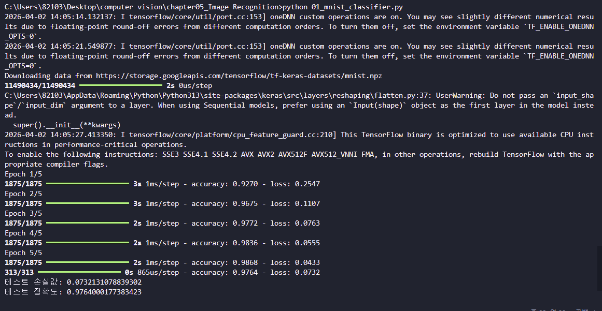
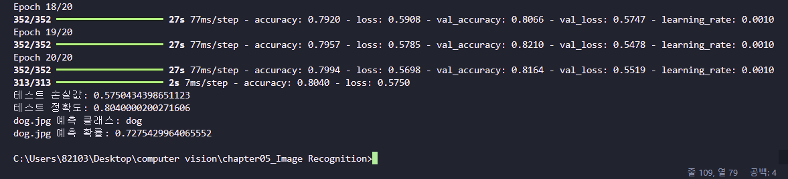

# 01. 간단한 이미지 분류기 구현

## 1) 제목

**MNIST 데이터셋을 이용한 간단한 이미지 분류기 구현**

---

## 2) 문제

손글씨 숫자 이미지 데이터셋인 **MNIST**를 이용하여 간단한 이미지 분류기를 구현한다.
주어진 숫자 이미지를 입력받아, 해당 이미지가 **0부터 9까지 어떤 숫자인지 분류**하는 신경망 모델을 작성하고 학습 및 평가한다.

---

## 3) 요구사항

* MNIST 데이터셋을 로드
* 데이터를 훈련 세트와 테스트 세트로 분할
* 간단한 신경망 모델 구축
* 모델을 훈련시키고 정확도를 평가

---

## 4) 개념

### 4-1. MNIST 데이터셋

MNIST는 손글씨 숫자 이미지로 이루어진 대표적인 이미지 분류 데이터셋이다.
각 이미지는 **28×28 크기의 흑백 이미지**이며, 정답 레이블은 **0~9 사이의 숫자**이다.

### 4-2. 정규화(Normalization)

이미지의 픽셀 값은 원래 0~255 범위이다.
이를 **255.0으로 나누어 0~1 범위**로 바꾸면 학습이 더 안정적으로 진행된다.

### 4-3. Sequential 모델

`Sequential`은 층을 순서대로 쌓는 가장 기본적인 신경망 모델이다.
이번 과제에서는 다음과 같은 구조를 사용한다.

* `Flatten`: 28×28 이미지를 1차원 벡터(784개 값)로 변환
* `Dense(128, activation='relu')`: 은닉층에서 특징 학습
* `Dense(10, activation='softmax')`: 10개의 숫자 클래스로 분류

### 4-4. 손실 함수와 정확도

* **loss = sparse_categorical_crossentropy**
  다중 클래스 분류 문제에서 사용되는 손실 함수이다.
* **metrics = ['accuracy']**
  전체 데이터 중 몇 개를 맞췄는지 정확도를 계산한다.

---

## 5) 전체 코드

```python
import tensorflow as tf  # 텐서플로우를 사용하기 위해 불러옴 -> MNIST 데이터 로드, 모델 구성, 학습, 평가가 가능해짐
from tensorflow.keras.datasets import mnist  # MNIST 데이터셋을 사용하기 위해 불러옴 -> 손글씨 숫자 이미지 데이터를 바로 불러올 수 있음
from tensorflow.keras.models import Sequential  # 순차형 신경망 모델을 만들기 위해 불러옴 -> 층을 순서대로 쌓아 간단한 분류기를 만들 수 있음
from tensorflow.keras.layers import Flatten, Dense  # 입력 평탄화와 완전연결층을 사용하기 위해 불러옴 -> 이미지 데이터를 1차원으로 바꾸고 숫자를 분류할 수 있음

(x_train, y_train), (x_test, y_test) = mnist.load_data()  # MNIST 데이터를 불러오기 위해 실행함 -> 훈련 세트와 테스트 세트가 각각 저장됨

x_train = x_train / 255.0  # 훈련 이미지의 픽셀 값을 정규화하기 위해 실행함 -> 0~255 값이 0~1 범위로 바뀌어 학습이 안정됨
x_test = x_test / 255.0  # 테스트 이미지의 픽셀 값을 정규화하기 위해 실행함 -> 평가할 때도 같은 기준의 입력값을 사용하게 됨

model = Sequential()  # 순차형 모델 객체를 만들기 위해 실행함 -> 신경망 층을 순서대로 추가할 준비가 됨
model.add(Flatten(input_shape=(28, 28)))  # 28x28 흑백 이미지를 1차원 벡터로 바꾸기 위해 실행함 -> 각 이미지가 784개의 입력값으로 변환됨
model.add(Dense(128, activation='relu'))  # 은닉층을 추가해 특징을 학습하기 위해 실행함 -> 이미지의 중요한 패턴을 학습할 수 있게 됨
model.add(Dense(10, activation='softmax'))  # 출력층을 추가해 0~9 숫자를 분류하기 위해 실행함 -> 각 숫자 클래스의 확률이 출력됨

model.compile(optimizer='adam', loss='sparse_categorical_crossentropy', metrics=['accuracy'])  # 모델의 학습 방법과 평가 기준을 설정하기 위해 실행함 -> Adam으로 학습하고 정확도를 함께 확인할 수 있음

model.fit(x_train, y_train, epochs=5, batch_size=32, verbose=1)  # 훈련 데이터를 사용해 모델을 학습시키기 위해 실행함 -> 에포크마다 손실과 정확도가 출력되며 분류 성능이 향상됨

test_loss, test_accuracy = model.evaluate(x_test, y_test, verbose=1)  # 테스트 데이터로 모델 성능을 평가하기 위해 실행함 -> 최종 손실값과 테스트 정확도가 계산됨

print("테스트 손실값:", test_loss)  # 평가 결과의 손실값을 확인하기 위해 실행함 -> 테스트 데이터에서의 오차 크기가 출력됨
print("테스트 정확도:", test_accuracy)  # 평가 결과의 정확도를 확인하기 위해 실행함 -> 테스트 데이터에서 숫자를 맞춘 비율이 출력됨
```

---

## 6) 핵심 코드

### 6-1. MNIST 데이터셋 불러오기

```python
(x_train, y_train), (x_test, y_test) = mnist.load_data()
```

* MNIST 데이터셋을 불러온다.
* 훈련용 데이터와 테스트용 데이터가 각각 나누어져 저장된다.

### 6-2. 데이터 정규화

```python
x_train = x_train / 255.0
x_test = x_test / 255.0
```

* 픽셀 값을 0~1 범위로 변환한다.
* 학습 속도와 안정성을 높일 수 있다.

### 6-3. 모델 구성

```python
model = Sequential()
model.add(Flatten(input_shape=(28, 28)))
model.add(Dense(128, activation='relu'))
model.add(Dense(10, activation='softmax'))
```

* `Flatten`으로 2차원 이미지를 1차원으로 펼친다.
* `Dense(128)`에서 이미지 특징을 학습한다.
* 마지막 `Dense(10)`에서 10개 숫자 클래스를 분류한다.

### 6-4. 모델 학습

```python
model.fit(x_train, y_train, epochs=5, batch_size=32, verbose=1)
```

* 훈련 데이터를 사용해 총 5번 반복 학습한다.
* 배치 크기는 32로 설정하여 학습한다.

### 6-5. 모델 평가

```python
test_loss, test_accuracy = model.evaluate(x_test, y_test, verbose=1)
```

* 테스트 데이터를 이용해 최종 성능을 평가한다.
* 손실값과 정확도를 확인할 수 있다.

---

## 7) 실행 방법

### 7-1. 파일 저장

예시 파일명:

```bash
01_mnist_classifier.py
```

### 7-2. TensorFlow 설치

터미널에서 아래 명령어를 실행한다.

```bash
python -m pip install tensorflow
```

### 7-3. 프로그램 실행

터미널에서 아래 명령어를 실행한다.

```bash
python 01_mnist_classifier.py
```

---

## 8) 실행 결과

실행 결과, MNIST 데이터셋이 다운로드된 뒤 모델이 5 에포크 동안 학습되었고, 각 에포크의 정확도와 손실값이 출력되었다.

### 학습 과정

* Epoch 1/5: accuracy = **0.9270**, loss = **0.2547**
* Epoch 2/5: accuracy = **0.9675**, loss = **0.1107**
* Epoch 3/5: accuracy = **0.9772**, loss = **0.0763**
* Epoch 4/5: accuracy = **0.9836**, loss = **0.0555**
* Epoch 5/5: accuracy = **0.9868**, loss = **0.0433**

### 최종 테스트 결과

* 테스트 손실값: **0.0732131078839302**
* 테스트 정확도: **0.9764000177383423**

즉, 테스트 데이터에 대해 약 **97.64%의 정확도**를 얻었다.

> 실행 화면은 첨부한 결과 이미지 참고



---

## 9) 실행 결과 분석

이번 실습에서는 매우 간단한 신경망 구조를 사용했음에도 불구하고 **97% 이상의 높은 정확도**를 얻을 수 있었다.
이는 MNIST 데이터셋이 비교적 단순한 흑백 숫자 이미지로 이루어져 있고, 숫자 형태가 일정한 패턴을 가지기 때문이다.

에포크가 진행될수록

* **정확도는 0.9270 → 0.9868로 증가**
* **손실값은 0.2547 → 0.0433으로 감소**

하는 모습을 확인할 수 있었다.
즉, 모델이 반복 학습을 통해 숫자 이미지의 특징을 점점 더 잘 학습했다는 뜻이다.

또한 최종 테스트 정확도가 **0.9764**로 높게 나타났으므로, 훈련 데이터뿐 아니라 처음 보는 테스트 데이터에 대해서도 잘 분류한다고 볼 수 있다.

다만 실행 중 다음과 같은 메시지가 함께 출력되었다.

* `oneDNN custom operations are on`
* `Do not pass an input_shape / input_dim argument to a layer...`

이 메시지들은 **오류가 아니라 경고 또는 안내 메시지**이다.
프로그램 실행과 학습 결과에는 큰 문제가 없으며, 모델도 정상적으로 학습되었다.

이번 과제를 통해 다음 내용을 확인할 수 있었다.

* MNIST 데이터셋을 쉽게 불러와 사용할 수 있다.
* `Sequential`, `Flatten`, `Dense`만으로도 기본적인 이미지 분류기를 만들 수 있다.
* 데이터 정규화가 학습 안정성에 도움이 된다.
* 간단한 완전연결 신경망만으로도 높은 숫자 분류 정확도를 얻을 수 있다.


---

# 02. CIFAR-10 데이터셋을 활용한 CNN 모델 구축

## 1) 제목

**CIFAR-10 데이터셋을 활용한 CNN(합성곱 신경망) 이미지 분류기 구현**

---

## 2) 문제

CIFAR-10 데이터셋을 이용하여 **합성곱 신경망(CNN)** 기반의 이미지 분류 모델을 구현한다.
데이터를 전처리하고 CNN 모델을 설계 및 학습한 뒤, 테스트 데이터에 대한 성능을 평가한다.
또한 별도로 주어진 **dog.jpg** 이미지에 대해 예측을 수행하여 모델이 어떤 클래스로 분류하는지 확인한다.

---

## 3) 요구사항

* CIFAR-10 데이터셋을 로드
* 데이터 전처리(정규화 등)를 수행
* CNN 모델을 설계하고 훈련
* 모델의 성능을 평가
* 테스트 이미지 **dog.jpg**에 대한 예측 수행

---

## 4) 개념

### 4-1. CIFAR-10 데이터셋

CIFAR-10은 대표적인 이미지 분류 데이터셋으로, 총 10개의 클래스로 이루어져 있다.

* airplane
* automobile
* bird
* cat
* deer
* dog
* frog
* horse
* ship
* truck

각 이미지는 **32×32 크기의 RGB 컬러 이미지**이며, 다양한 물체가 포함되어 있다.

---

### 4-2. CNN(Convolutional Neural Network)

CNN은 이미지처럼 **공간적 구조를 가진 데이터**를 처리하는 데 적합한 신경망이다.
일반적인 완전연결층(Dense)만 사용하는 모델보다 이미지의 특징을 더 잘 추출할 수 있다.

이번 과제에서 사용한 주요 레이어는 다음과 같다.

* **Conv2D**: 이미지에서 가장자리, 모서리, 패턴 등의 특징을 추출
* **MaxPooling2D**: 특징 맵 크기를 줄여 계산량을 감소
* **Flatten**: 2차원 특징 맵을 1차원으로 펼침
* **Dense**: 최종 분류 수행
* **Dropout**: 일부 뉴런을 무작위로 비활성화하여 과적합을 방지

---

### 4-3. 정규화(Normalization)

이미지 픽셀 값은 원래 0\~255 범위이다.  
이를 **255.0으로 나누어 0\~1 범위로 변환**하면 학습이 안정적이고 빠르게 진행될 수 있다.

---

### 4-4. 조기 종료와 학습률 감소

이번 코드에서는 학습 성능을 더 안정적으로 만들기 위해 다음 콜백을 사용했다.

* **EarlyStopping**

  * 검증 정확도가 더 이상 좋아지지 않으면 학습을 조기에 종료
  * 불필요한 학습을 줄이고 과적합을 방지

* **ReduceLROnPlateau**

  * 검증 손실이 개선되지 않으면 학습률을 줄임
  * 학습 후반에 더 세밀하게 가중치를 조정할 수 있음

---

## 5) 전체 코드

```python
import tensorflow as tf  # 텐서플로우를 사용하기 위해 불러옴 -> CIFAR-10 로드, CNN 구성, 학습, 평가, 예측이 가능해짐
from tensorflow.keras.datasets import cifar10  # CIFAR-10 데이터셋을 불러오기 위해 사용함 -> 10개 클래스의 이미지 데이터를 바로 받을 수 있음
from tensorflow.keras.models import Sequential  # 순차형 모델을 만들기 위해 사용함 -> CNN 층을 순서대로 쌓을 수 있음
from tensorflow.keras.layers import Input, Conv2D, MaxPooling2D, Flatten, Dense, Dropout  # CNN 구성에 필요한 층을 사용함 -> 특징 추출과 분류를 수행할 수 있음
from tensorflow.keras.callbacks import EarlyStopping, ReduceLROnPlateau  # 학습 제어를 위해 사용함 -> 과적합을 줄이고 불필요한 학습 시간을 줄일 수 있음
from pathlib import Path  # 파일 경로를 다루기 위해 사용함 -> images/dog.jpg 위치를 안전하게 찾을 수 있음
import numpy as np  # 예측 결과 처리에 사용함 -> 가장 높은 확률의 클래스를 고를 수 있음

# ===================== GPU 확인 및 설정 =====================
gpus = tf.config.list_physical_devices('GPU')  # 텐서플로우가 인식한 GPU 목록을 확인함 -> GPU 사용 가능 여부를 확인할 수 있음

if gpus:  # 사용 가능한 GPU가 있는지 확인함 -> GPU가 있으면 학습을 더 빠르게 진행할 수 있음
    try:  # GPU 메모리 증가 방식을 설정하기 위해 시도함 -> 처음부터 모든 GPU 메모리를 점유하지 않게 할 수 있음
        for gpu in gpus:  # 인식된 GPU 각각에 대해 반복함 -> 여러 GPU가 있어도 모두 설정할 수 있음
            tf.config.experimental.set_memory_growth(gpu, True)  # 필요한 만큼만 GPU 메모리를 사용하도록 설정함 -> 메모리 관련 오류를 줄이는 데 도움을 줌
        print("TensorFlow가 인식한 GPU:", gpus)  # GPU 목록을 출력함 -> 실제로 GPU가 잡혔는지 확인할 수 있음
    except RuntimeError as e:  # 장치 초기화 후 설정 시 오류가 날 수 있어 예외 처리함 -> 코드가 중단되지 않게 함
        print("GPU 설정 중 오류:", e)  # 오류 내용을 출력함 -> 설정 실패 원인을 확인할 수 있음
else:  # GPU가 없는 경우를 처리함 -> CPU로 실행됨
    print("GPU를 찾지 못했습니다. CPU로 실행됩니다.")  # GPU 미인식 상태를 출력함 -> 환경 점검이 가능해짐

class_names = ['airplane', 'automobile', 'bird', 'cat', 'deer', 'dog', 'frog', 'horse', 'ship', 'truck']  # CIFAR-10 클래스 이름을 저장함 -> 예측 결과를 보기 쉽게 출력할 수 있음

# ===================== 데이터 로드 및 전처리 =====================
(x_train, y_train), (x_test, y_test) = cifar10.load_data()  # CIFAR-10 데이터를 불러옴 -> 훈련용/테스트용 이미지와 레이블이 준비됨

x_train = x_train.astype('float32') / 255.0  # 훈련 이미지 픽셀을 정규화함 -> 0~255 값을 0~1 범위로 바꿔 학습을 안정화함
x_test = x_test.astype('float32') / 255.0  # 테스트 이미지 픽셀을 정규화함 -> 훈련 데이터와 같은 기준으로 평가할 수 있음

# ===================== CNN 모델 구성 =====================
model = Sequential()  # 순차형 CNN 모델 객체를 생성함 -> 층을 차례대로 추가할 수 있게 됨
model.add(Input(shape=(32, 32, 3)))  # 입력 이미지 크기를 지정함 -> 32x32 크기의 컬러 이미지를 받게 됨

model.add(Conv2D(32, (3, 3), activation='relu', padding='same'))  # 첫 번째 합성곱 층을 추가함 -> 기본적인 이미지 특징을 추출함
model.add(Conv2D(32, (3, 3), activation='relu', padding='same'))  # 합성곱 층을 한 번 더 추가함 -> 같은 단계의 특징을 더 풍부하게 학습함
model.add(MaxPooling2D((2, 2)))  # 풀링 층을 추가함 -> 특징 맵 크기를 줄여 계산량을 감소시킴
model.add(Dropout(0.25))  # 드롭아웃을 추가함 -> 과적합을 줄이는 데 도움을 줌

model.add(Conv2D(64, (3, 3), activation='relu', padding='same'))  # 두 번째 블록의 합성곱 층을 추가함 -> 더 복잡한 특징을 추출할 수 있음
model.add(Conv2D(64, (3, 3), activation='relu', padding='same'))  # 같은 단계의 특징을 반복 추출함 -> 분류 성능 향상에 도움을 줌
model.add(MaxPooling2D((2, 2)))  # 두 번째 풀링 층을 추가함 -> 특징 맵 크기를 더 줄여 속도를 높임
model.add(Dropout(0.30))  # 드롭아웃을 추가함 -> 중간층 과적합을 줄일 수 있음

model.add(Conv2D(128, (3, 3), activation='relu', padding='same'))  # 세 번째 블록의 합성곱 층을 추가함 -> 더 높은 수준의 특징을 학습함
model.add(MaxPooling2D((2, 2)))  # 세 번째 풀링 층을 추가함 -> 마지막 특징 맵 크기를 줄여 Dense층 부담을 줄임
model.add(Dropout(0.30))  # 드롭아웃을 추가함 -> 마지막 특징 추출 단계에서도 과적합을 방지함

model.add(Flatten())  # 2차원 특징 맵을 1차원으로 펼침 -> Dense 층에 입력할 수 있는 형태가 됨
model.add(Dense(256, activation='relu'))  # 완전연결층을 추가함 -> 추출한 특징을 바탕으로 클래스를 구분함
model.add(Dropout(0.50))  # 드롭아웃을 추가함 -> Dense 구간의 과적합을 강하게 줄여줌
model.add(Dense(10, activation='softmax'))  # 출력층을 추가함 -> 10개 클래스의 확률을 출력함

# ===================== 모델 컴파일 =====================
model.compile(  # 모델의 학습 방식을 설정함 -> 옵티마이저, 손실 함수, 평가 지표가 정해짐
    optimizer=tf.keras.optimizers.Adam(learning_rate=0.001),  # Adam 옵티마이저를 사용함 -> 비교적 빠르고 안정적으로 학습할 수 있음
    loss='sparse_categorical_crossentropy',  # 정수형 레이블에 맞는 손실 함수를 사용함 -> 다중 클래스 분류 오차를 계산할 수 있음
    metrics=['accuracy']  # 정확도를 함께 확인함 -> 에폭마다 성능 변화를 볼 수 있음
)

# ===================== 콜백 설정 =====================
early_stopping = EarlyStopping(  # 조기 종료 콜백을 설정함 -> 성능 향상이 멈추면 학습을 자동으로 끝낼 수 있음
    monitor='val_accuracy',  # 검증 정확도를 감시함 -> 성능 기준으로 멈추게 됨
    patience=4,  # 4에폭 동안 개선이 없으면 중단함 -> 시간을 아낄 수 있음
    restore_best_weights=True  # 가장 성능이 좋았던 가중치로 복원함 -> 최종 모델 품질을 유지할 수 있음
)

reduce_lr = ReduceLROnPlateau(  # 학습률 감소 콜백을 설정함 -> 학습이 정체되면 더 세밀하게 학습할 수 있음
    monitor='val_loss',  # 검증 손실을 감시함 -> 손실 개선이 없을 때 학습률을 줄임
    factor=0.5,  # 학습률을 절반으로 줄임 -> 급하게 움직이던 학습을 더 안정적으로 바꿀 수 있음
    patience=2,  # 2에폭 동안 개선이 없으면 적용함 -> 너무 빨리 줄이지 않도록 함
    min_lr=1e-5  # 학습률 하한을 설정함 -> 지나치게 작아지는 것을 막음
)

# ===================== 모델 학습 =====================
history = model.fit(  # 모델 학습을 시작함 -> 훈련 데이터로 CNN이 패턴을 학습하게 됨
    x_train, y_train,  # 훈련 이미지와 정답 레이블을 전달함 -> 학습에 사용됨
    epochs=20,  # 최대 20에폭까지 학습함 -> 너무 오래 돌지 않도록 적당히 제한함
    batch_size=128,  # 배치 크기를 128로 설정함 -> GPU에서도 안정적으로 학습하기 좋음
    validation_split=0.1,  # 훈련 데이터의 10%를 검증용으로 사용함 -> 과적합 여부를 확인할 수 있음
    callbacks=[early_stopping, reduce_lr],  # 콜백을 적용함 -> 자동 조기 종료와 학습률 조정이 수행됨
    verbose=1  # 학습 과정을 출력함 -> 에폭별 손실과 정확도를 확인할 수 있음
)

# ===================== 모델 평가 =====================
test_loss, test_accuracy = model.evaluate(x_test, y_test, verbose=1)  # 테스트 데이터로 모델을 평가함 -> 최종 손실값과 정확도가 계산됨

print("테스트 손실값:", test_loss)  # 테스트 손실값을 출력함 -> 테스트 데이터에서의 오차를 확인할 수 있음
print("테스트 정확도:", test_accuracy)  # 테스트 정확도를 출력함 -> 최종 분류 성능을 확인할 수 있음

# ===================== 이미지 예측 =====================
base_path = Path(__file__).resolve().parent if "__file__" in globals() else Path.cwd()  # 현재 파이썬 파일 기준 폴더를 구함 -> 실행 위치와 무관하게 파일을 찾을 수 있음
img_path = base_path / "images" / "dog.jpg"  # images/dog.jpg 경로를 지정함 -> VSCode 프로젝트 폴더 기준으로 이미지를 찾게 됨

if img_path.exists():  # dog.jpg 파일 존재 여부를 확인함 -> 파일이 있을 때만 예측을 진행함
    img_data = tf.io.read_file(str(img_path))  # 이미지 파일을 읽음 -> 원본 바이트 데이터를 불러옴
    img = tf.image.decode_jpeg(img_data, channels=3)  # JPEG 이미지를 텐서로 변환함 -> 컬러 이미지 배열이 만들어짐
    img = tf.image.resize(img, [32, 32])  # CIFAR-10 입력 크기에 맞게 조정함 -> 32x32 크기로 변환됨
    img = tf.cast(img, tf.float32) / 255.0  # 예측용 이미지도 정규화함 -> 훈련 데이터와 같은 범위로 맞춤
    img = tf.expand_dims(img, axis=0)  # 배치 차원을 추가함 -> 모델 입력 형식에 맞게 4차원으로 바뀜

    predictions = model.predict(img, verbose=0)  # dog.jpg의 클래스를 예측함 -> 10개 클래스 확률이 계산됨
    predicted_index = int(np.argmax(predictions[0]))  # 가장 확률이 높은 클래스 번호를 찾음 -> 최종 예측 인덱스가 결정됨
    predicted_class = class_names[predicted_index]  # 클래스 번호를 이름으로 바꿈 -> 사람이 읽기 쉬운 결과가 됨
    predicted_prob = float(predictions[0][predicted_index])  # 해당 클래스의 확률값을 저장함 -> 모델의 확신 정도를 확인할 수 있음

    print("dog.jpg 예측 클래스:", predicted_class)  # 예측된 클래스 이름을 출력함 -> 예를 들어 dog, cat 등이 표시됨
    print("dog.jpg 예측 확률:", predicted_prob)  # 예측 확률을 출력함 -> 해당 결과의 신뢰도를 볼 수 있음
else:  # dog.jpg가 없는 경우를 처리함 -> 예측 대신 안내 문구를 출력함
    print(f"파일을 찾을 수 없습니다: {img_path}")  # 실제 찾은 경로를 출력함 -> 경로 문제를 바로 확인할 수 있음
```

---

## 6) 핵심 코드

### 6-1. CIFAR-10 데이터셋 로드 및 정규화

```python
(x_train, y_train), (x_test, y_test) = cifar10.load_data()

x_train = x_train.astype('float32') / 255.0
x_test = x_test.astype('float32') / 255.0
```

* CIFAR-10 훈련 데이터와 테스트 데이터를 불러온다.
* 픽셀 값을 0~1 범위로 정규화하여 학습을 안정화한다.

---

### 6-2. CNN 모델 구성

```python
model = Sequential()
model.add(Input(shape=(32, 32, 3)))

model.add(Conv2D(32, (3, 3), activation='relu', padding='same'))
model.add(Conv2D(32, (3, 3), activation='relu', padding='same'))
model.add(MaxPooling2D((2, 2)))
model.add(Dropout(0.25))

model.add(Conv2D(64, (3, 3), activation='relu', padding='same'))
model.add(Conv2D(64, (3, 3), activation='relu', padding='same'))
model.add(MaxPooling2D((2, 2)))
model.add(Dropout(0.30))

model.add(Conv2D(128, (3, 3), activation='relu', padding='same'))
model.add(MaxPooling2D((2, 2)))
model.add(Dropout(0.30))

model.add(Flatten())
model.add(Dense(256, activation='relu'))
model.add(Dropout(0.50))
model.add(Dense(10, activation='softmax'))
```

* 여러 개의 합성곱층을 통해 이미지 특징을 단계적으로 추출한다.
* 풀링층으로 특징 맵 크기를 줄인다.
* 드롭아웃으로 과적합을 방지한다.
* 마지막 Dense층에서 10개 클래스 중 하나로 분류한다.

---

### 6-3. 모델 컴파일

```python
model.compile(
    optimizer=tf.keras.optimizers.Adam(learning_rate=0.001),
    loss='sparse_categorical_crossentropy',
    metrics=['accuracy']
)
```

* Adam 옵티마이저를 사용하여 학습한다.
* 정수형 레이블에 적합한 sparse categorical crossentropy를 사용한다.
* 정확도를 함께 출력하도록 설정한다.

---

### 6-4. 콜백 설정

```python
early_stopping = EarlyStopping(
    monitor='val_accuracy',
    patience=4,
    restore_best_weights=True
)

reduce_lr = ReduceLROnPlateau(
    monitor='val_loss',
    factor=0.5,
    patience=2,
    min_lr=1e-5
)
```

* 검증 정확도가 좋아지지 않으면 조기에 종료할 수 있다.
* 검증 손실이 개선되지 않으면 학습률을 줄여 더 안정적인 학습이 가능하다.

---

### 6-5. dog.jpg 예측

```python
img_path = base_path / "images" / "dog.jpg"

if img_path.exists():
    img_data = tf.io.read_file(str(img_path))
    img = tf.image.decode_jpeg(img_data, channels=3)
    img = tf.image.resize(img, [32, 32])
    img = tf.cast(img, tf.float32) / 255.0
    img = tf.expand_dims(img, axis=0)

    predictions = model.predict(img, verbose=0)
    predicted_index = int(np.argmax(predictions[0]))
    predicted_class = class_names[predicted_index]
    predicted_prob = float(predictions[0][predicted_index])

    print("dog.jpg 예측 클래스:", predicted_class)
    print("dog.jpg 예측 확률:", predicted_prob)
```

* 별도의 dog.jpg 이미지를 읽어서 모델 입력 크기인 32×32로 조정한다.
* 정규화 후 예측을 수행한다.
* 가장 높은 확률의 클래스를 최종 결과로 출력한다.

---

## 7) 실행 방법

### 7-1. 파일 저장

예시 파일명:

```bash
02_cifar10_cnn_classifier.py
```

---

### 7-2. 폴더 구성

다음과 같이 폴더를 구성한다.

```bash
chapter05_Image Recognition/
├─ 02_cifar10_cnn_classifier.py
└─ images/
   └─ dog.jpg
```

---

### 7-3. TensorFlow 설치

터미널에서 아래 명령어를 실행한다.

```bash
python -m pip install tensorflow
```

---

### 7-4. 프로그램 실행

터미널에서 아래 명령어를 실행한다.

```bash
python 02_cifar10_cnn_classifier.py
```

---

## 8) 실행 결과

실행 결과, CIFAR-10 데이터셋으로 CNN 모델을 학습한 뒤 테스트 데이터셋과 dog.jpg 이미지에 대해 다음과 같은 결과가 출력되었다.

### 최종 테스트 결과

* 테스트 손실값: **0.5750434398651123**
* 테스트 정확도: **0.8040000200271606**

즉, 테스트 데이터에 대해 약 **80.40%의 정확도**를 얻었다.

### dog.jpg 예측 결과

* dog.jpg 예측 클래스: **dog**
* dog.jpg 예측 확률: **0.7275429964065552**

즉, 주어진 강아지 이미지에 대해 모델은 **dog 클래스로 예측**했으며, 약 **72.75%의 확률**로 판단하였다.

### 학습 후반부 출력

* Epoch 18/20: accuracy = **0.7920**, loss = **0.5908**, val_accuracy = **0.8066**, val_loss = **0.5747**
* Epoch 19/20: accuracy = **0.7957**, loss = **0.5785**, val_accuracy = **0.8210**, val_loss = **0.5478**
* Epoch 20/20: accuracy = **0.7994**, loss = **0.5698**, val_accuracy = **0.8164**, val_loss = **0.5519**




---

## 9) 실행 결과 분석

이번 실습에서는 CIFAR-10 데이터셋을 이용해 CNN 모델을 구성하고 학습하였다.
MNIST보다 CIFAR-10은 컬러 이미지이고 클래스의 형태가 더 다양하기 때문에, 분류 난이도가 더 높다. 그럼에도 불구하고 약 **80.4%의 테스트 정확도**를 얻었으므로, 비교적 안정적으로 학습되었다고 볼 수 있다.

학습 후반부 결과를 보면 훈련 정확도와 검증 정확도가 모두 점진적으로 향상되었다.

* Epoch 18: 훈련 정확도 **79.20%**, 검증 정확도 **80.66%**
* Epoch 19: 훈련 정확도 **79.57%**, 검증 정확도 **82.10%**
* Epoch 20: 훈련 정확도 **79.94%**, 검증 정확도 **81.64%**

이를 통해 모델이 단순히 훈련 데이터만 외운 것이 아니라, 검증 데이터에 대해서도 일정 수준 이상의 일반화 성능을 보였음을 확인할 수 있다.

또한 dog.jpg 예측 결과가 **dog**로 올바르게 분류되었고, 확률도 약 **72.75%**로 비교적 높게 나타났다.
이는 모델이 CIFAR-10의 dog 클래스 특징을 어느 정도 잘 학습했음을 보여준다.

이번 코드에서 성능 향상에 도움을 준 요소는 다음과 같다.

* **Conv2D + MaxPooling2D**를 여러 번 사용하여 이미지 특징을 단계적으로 추출
* **Dropout**을 사용하여 과적합을 완화
* **EarlyStopping**으로 불필요한 학습을 줄임
* **ReduceLROnPlateau**로 학습 후반에 학습률을 낮춰 더 안정적으로 학습

다만 CIFAR-10은 이미지 크기가 작고 클래스 간 형태가 비슷한 경우가 많아서, 100%에 가까운 정확도를 얻기는 어렵다.
더 높은 성능을 원한다면 다음과 같은 방법을 추가로 시도할 수 있다.

* 데이터 증강(Data Augmentation) 적용
* BatchNormalization 추가
* 더 깊은 CNN 구조 사용
* 학습 epoch 증가
* 전이학습(Transfer Learning) 활용

종합하면, 이번 과제는 **CIFAR-10 데이터셋에 대해 CNN을 활용한 이미지 분류 과정을 직접 구현하고, 실제 dog 이미지 예측까지 수행했다는 점에서 의미가 있다.**
